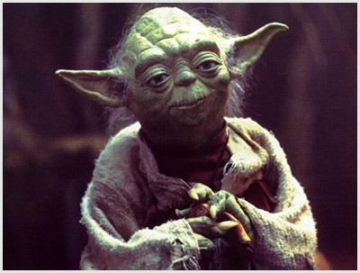

// #region settings
+++
title = "Как прокачать силу воли" 
draft = false
date = "2013-09-11T20:25:00-07:00"
lastmod = "2018-04-11T01:46:42-07:00"
id = "5417957065349489792"
+++
include::https://cdn.jsdelivr.net/gh/pashkas/levelupblog/locale/attributes-ru.adoc[]
:doctype: article
:footer: nofooter
:leveloffset: 1
:encoding: utf-8
:lang: ru
:icons: font
:sectnumlevels: 0
:!figure-caption:
:!table-caption:
:imagesdir: https://cdn.jsdelivr.net/gh/pashkas/levelupblog/2013 - Как прокачать силу воли/
// #endregion

image:кунфуПанда.png[]

_Мастерами кун-фу не рождаются - мастерами кун-фу становятся! Опасностей не пугаются, приемы точны - все сбудется!_

_Одним из важнейших качеств характера любого человека является сила воли. Практически каждый человек во многом знает как ему жить, что нужно сделать, чтобы его жизнь становилась лучше и он сам становился красивее, здоровее и счастливее. Но, к сожалению, не каждому хватает терпения и упорства, чтобы изменить что-либо в своей жизни, сделать то, что задумал. В этой статье я постараюсь дать несколько советов о том, как можно развить силу воли._

++++
<!--more-->
++++

= Не поддавайся темной стороне силы!

*Сила воли очень важный навык, но в то же время и очень опасный.* Нет ничего хуже, чем тупое упрямство в достижении вредных целей. Всегда помни, что цель не оправдывает средства и о том, что подходить к любому делу нужно продуманно и планомерно.

_Например, если ты обидел человека, то не нужно проявлять чудеса силы воли и тупо стоять на своем даже если ты знаешь, что был не прав._

_Во время тренировок не стоит нагружать себя сверх положенного, чтобы не получить травму, или не стоит показывать свою стойкость, изображая как много алкоголя ты можешь в себя вместить._

Не будь упрямым ослом, помни, что у тебя есть разум. Старайся, чтобы то что ты делаешь и к чему стремишься было позитивно. Подумай, как повлияет твое упорство на будущее и к каким позитивным и негативным последствиям оно может привести.

http://nerdistway.blogspot.com/2014/02/blog-post.html[Не поддавайся темной стороне силы!]

= Скорее всего, ты насчет себя заблуждаешься!

*Ты можешь оправдывать себя тем, что у тебя нет силы воли, http://nerdistway.blogspot.com/2014/08/blog-post_28.html[что ты таким родился].* Но у каждого человека она есть, хоть какая-то, но есть. И ее можно развить, также, как и любой навык, стоит только захотеть, понять, что это нужно и важно, быть последовательным и постепенным в своих позитивных улучшениях. У каждого есть сила воли!

= Начни с малого.

*Помни, что каждый раз, когда ты делаешь что-то, что задумал, ты прокачиваешь свою волю, а когда откладываешь или не делаешь, то ты ее ослабляешь.* Поэтому, начни с чего-то небольшого и постоянного, что ты точно сможешь выполнить, а потом делай это каждый день несмотря ни на что!

Будь осторожен и не берись на первых порах за то, с чем чувствуешь, что можешь не справиться. По мере развития силы воли ты будешь ощущать, что можешь браться за более сложные дела. Главное начать и поверить в себя!

И помни - https://nerdistway.blogspot.com/2013/12/blog-post_27.html[сила воли - конечный ресурс, но его можно развивать]! 

= Выполняй обещания

*Чтобы прокачать силу воли ты должен стать человеком слова.* Поставь себе в высший приоритет обещания, которые ты даешь. Ведь если подумать, сила воли - это и есть способность выполнять обещания данные другим и СЕБЕ. Способность выполнить обещание, сделать что-то или отказать себе в чем-то.

Но не обещай того, что не сможешь сделать!

= Будь аскетичным

Иногда отказывай себе в удовольствиях. Ограничивай себя в комфорте, живи просто. Это закаляет характер и, к тому же обостряет чувства.

= Приобретай хорошие привычки и борись с плохими

*Ежедневная борьба с самим собой - вот то, что закаляет характер!* Нет ничего сложнее и важнее, чем менять свои привычки, потому что то, какая твоя жизнь сейчас очень сильно зависит от того, что ты делаешь или не делаешь постоянно, день за днем, год за годом.

Подобно тому, как капли воды могут пробить дыру в камне, так же и твои привычки меняют твою жизнь. Выбери несколько привычек, над которыми ты бы хотел поработать и чувствуешь, что можешь справиться, и работай над ними не пропуская ни одного раза, ни одного дня!

Если тебе нужна помощь в приобретении привычек - https://nerdistway.blogspot.com/2013/07/mylife-rpg-organizer.html[воспользуйся программой РПГ Органайзер]!

= "Партия сказала надо"

Понятно, что мы все думающие, разумные люди, можем мотивировать себя, долго размышлять о том, как что-либо полезно, вредно, какие выгоды принесет, пытаться применять какие-либо психотехники, но сейчас мы тренируем силу воли. Поэтому почаще говори себе - "Надо!" и делай!

= Добивайся своих целей

*Берись за глобальные жизненные проекты и выполняй их!* Воспринимай дело или задачу как спринт, а достижение цели как марафон. Пробеги марафон. Главное, для начала не ставь себе очень сложных целей, главное поверить в себя и приобрести привычку http://nerdistway.blogspot.com/2013/12/blog-post_27.html[делать то, что решил]. 7 раз подумай - 1 раз сделай!

= Разгребай завалы недоделанных и отложенных дел.

*Делай отложенные, запущенные и недоделанные дела.* Это как правило как раз те дела, которые делать не хочется, но НАДО. Или хотя бы наберись смелости и воли для того, чтобы решить, что ты это делать не будешь, тебе это не нужно.

_Как компромисс, можно завести себе список "когда-нибудь", и записывать туда такие дела. Просматривать его изредка, но понимать, что это не список дел, не обещание, а некий справочник твоих идей… Постоянное откладывание снижает силу воли._

*Итак, подытожим:*

* Сила воли очень важна
* Ее можно "прокачать"
* Если ты делаешь то, что задумал, это улучшает силу воли
* Если ты откладываешь дела, это ухудшает силу воли
* Сражайся со своими привычками!
* Достигай целей!
* Будь постоянен в том, что решил!