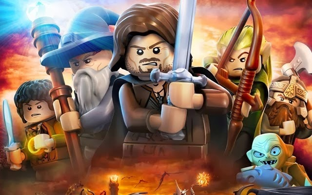
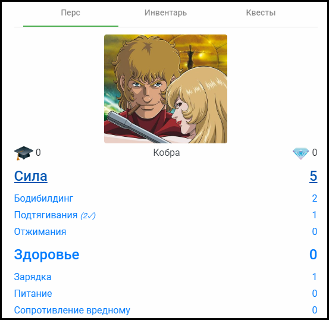
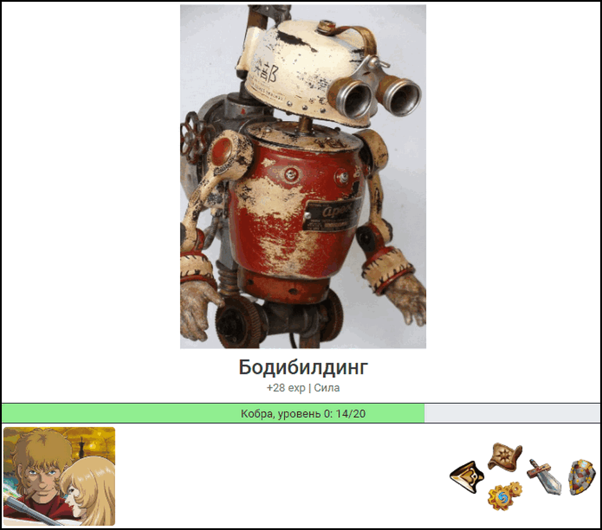
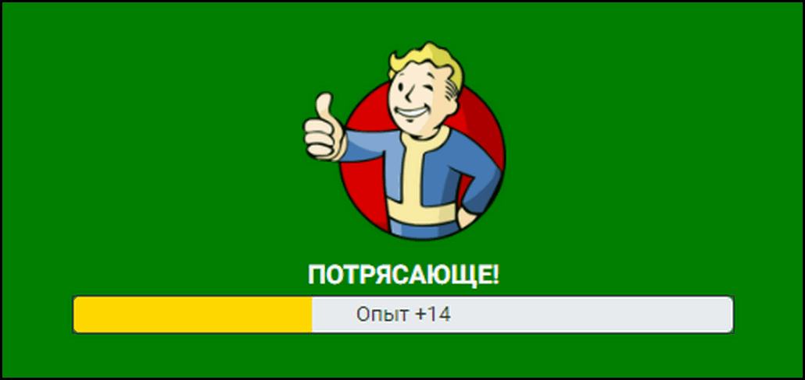
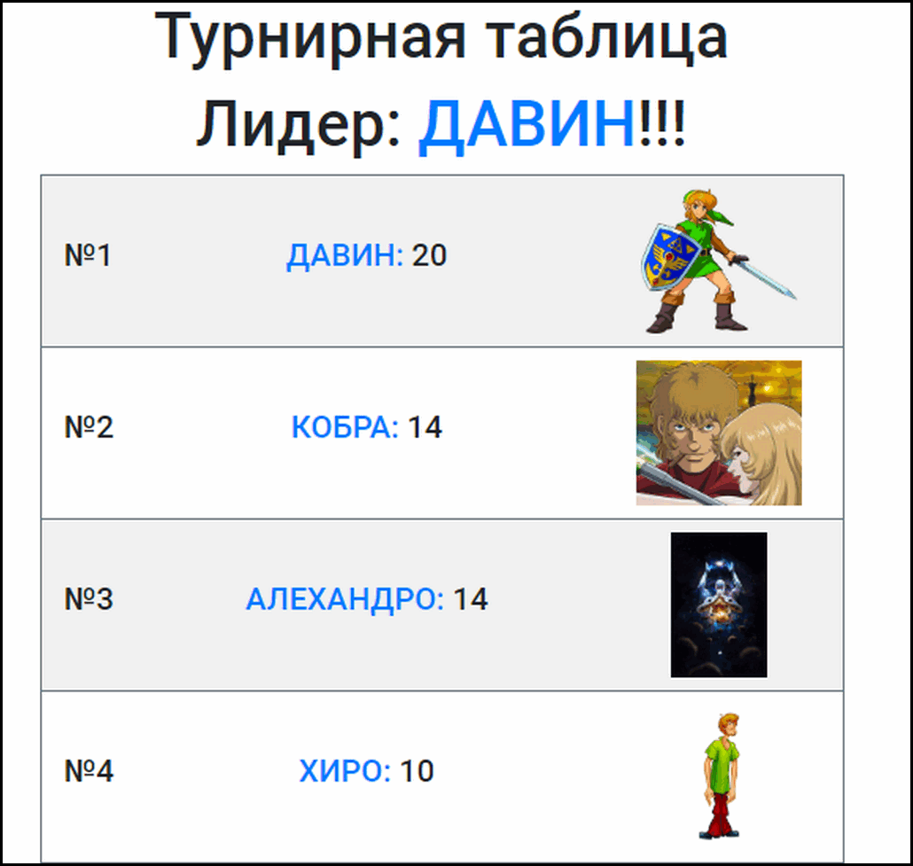

// #region settings
+++
title = "О программе РПГ Органайзер!" 
draft = false
id = 2660611215266768037
publishdate = 2013-05-02T12:00:00+03:00
+++
include::https://cdn.jsdelivr.net/gh/pashkas/levelupblog/locale/attributes-ru.adoc[]
:doctype: article
:footer: nofooter
:leveloffset: 1
:encoding: utf-8
:lang: ru
:icons: font
:sectnumlevels: 0
:!figure-caption:
:!table-caption:
:imagesdir: https://cdn.jsdelivr.net/gh/pashkas/levelupblog/2013 - О Программе РПГ Органайзер/
// #endregion

_Мир изменился…_

Системы достижения целей и менеджеры задач перестали справляться со своим предназначением. Скучные списки дел не приводят к результатам, а вносят уныние.

С сегодняшнего дня открывается портал во вселенную РПГ, где ты создашь ГЕРОЯ и прокачаешь себя в реальной жизни!

= РПГ Органайзер это…

*С одной стороны - необычный таск-менеджер (ToDo List)*, в том плане, что ты назначаешь себе задания и выполняешь.

*С другой - игра*, нацеленная на самосовершенствование.

*РПГ Органайзер это инструмент* для самосовершенствования, организации режима дня и достижения баланса.

Создай персонажа, олицетворяющего тебя. Настрой способности, придумай увлекательные квесты и выполняй действия, повышающие твой уровень!

= Скриншоты

Экран персонажа:

Панель задач:

Получение опыта:

Турнирная таблица:

Ты готов к приключениям?

Присоединяйся и получи абсолютно бесплатно доступ к РПГ Органайзеру с любого устройства, имеющего доступ в интернет!

++++
<!-- Begin MailChimp Signup Form -->
<link href="//cdn-images.mailchimp.com/embedcode/slim-10_7.css" rel="stylesheet" type="text/css">

<table style="width: 100%;">
<tr>
<td style="vertical-align: middle">
</img>
</td>
<td style="vertical-align: middle">
<form action="https://blogspot.us14.list-manage.com/subscribe/post?u=98515752cf454f1f654734adc&amp;id=9dcba274e3" method="post" id="mc-embedded-subscribe-form" name="mc-embedded-subscribe-form" class="validate" target="_blank" novalidate>
    

    
<b>Получить доступ к РПГ Органайзеру!</b>

    <input type="email" value="" name="EMAIL" class="email" id="mce-EMAIL" placeholder="Твой Email" required>
    <!-- real people should not fill this in and expect good things - do not remove this or risk form bot signups-->
    
<input type="text" name="b_98515752cf454f1f654734adc_9dcba274e3" tabindex="-1" value="">

    
<input type="submit" value="ОК!" name="subscribe" id="mc-embedded-subscribe" class="button">

    

</form>
</td>
</tr>
</table>

<!--End mc_embed_signup-->
++++