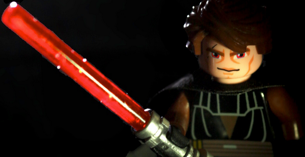
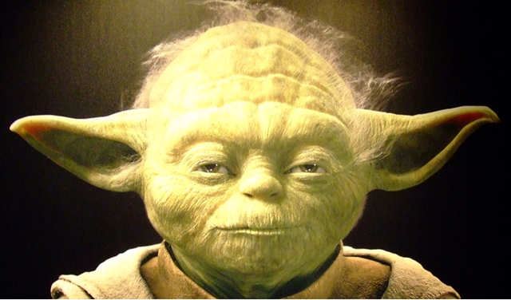

// #region settings
+++
title = "Советы от Дарта Вейдера для достижения успеха" 
draft = false
id = 3042484759527962612
publishdate = 2014-02-11T12:00:00+03:00
+++
include::https://cdn.jsdelivr.net/gh/pashkas/levelupblog/locale/attributes-ru.adoc[]
:doctype: article
:footer: nofooter
:leveloffset: 1
:encoding: utf-8
:lang: ru
:icons: font
:sectnumlevels: 0
:!figure-caption:
:!table-caption:
:imagesdir: https://cdn.jsdelivr.net/gh/pashkas/levelupblog/2014 - Советы от Дарта Вейдера для достижения успеха/
// #endregion

_Дарт Вейдер – один из наиболее ярких персонажей вселенной фильма “Звездные Войны”. С определенной точки зрения, массовые убийства, жестокое угнетение, и обман для служения своим целям, показывает его как довольно плохого парня. Но хотя он и является отрицательным персонажем, он – сложная многогранная личность, верная своему долгу, кодексу чести, цели, во многом достойная восхищения, и у него есть чему поучиться! В этом посте я постараюсь раскрыть некоторые советы, которые можно почерпнуть, если внимательно и творчески взглянуть на характер этого персонажа._

++++
<!--more-->
++++

== Используй темную сторону силы

*Доводилось ли тебе когда-нибудь испытывать злость, досаду, или агрессию?*

Например:

* Начальник/любимая девушка/друг сказал или сделал что-то неприятное. 
* Ты почувствовал несправедливость по отношению к себе или пренебрежение.
* На работе кто-то незаслуженно получил повышение, или незнакомый человек нахамил тебе на улице.

Так или иначе, все это может случиться с каждым. Если произошла ситуация, которая “задела” тебя - твое тело переходит в режим “бежать или сражаться”, твой организм начинает вырабатывать огромное количество энергии, адреналина, или СИЛЫ. И тут уже тебе решать, как с ней поступить.

Хорошо, если ты сможешь успокоить себя с помощью дыхательных упражнений, медитаций, правильных убеждений, то есть нейтрализовать в себе ТЕМНУЮ СТОРОНУ СИЛЫ, которой ты теперь переполнен. А если нет? Держать в себе – прямой путь к стрессу, депрессии и чувству собственной неполноценности.
Выплеснуть агрессию на себя, уничтожая свое здоровье, пытаясь расслабиться с помощью алкоголя, игромании, курения, обжорства – сам понимаешь, к чему это приведет!

*Направь СИЛУ на уничтожение препятствий!*

* *Кто-то оскорбил тебя?* Постарайся улучить момент, для того, чтобы “поработать мускулами”. Отожмись, подтянись, потренируйся в красноречии, почитав толковую книгу. _Позже они не посмеют сделать что-либо подобное!_
* *Повысили коллегу, а не тебя?* Начни работать с двойной отдачей и страстью, возьми на себя дополнительные обязанности, открой свой личный проект. _Они еще будут умолять тебя, чтобы ты продолжал на них работать!_
* *Тобой пренебрегают?* Понятное дело, что ты многогранная личность, с богатым внутренним миром! Но сделай что-нибудь для улучшения своего “внешнего мира”! Сделай какие-то конкретные действия для улучшения своего финансового состояния, внешнего вида, общения с другими людьми (точно есть люди, нуждающиеся в тебе). _Заставь их уважать тебя, пусть они боятся потерять тебя!_

_Вот прямо сейчас – иди и отожмись 40 раз, уничтожь парочку задач из “долгого ящика”, или поработай так, чтобы все обалдели!_

*Совет Мастера Йоды:*
"_http://nerdistway.blogspot.com/2014/03/blog-post.html[Только не увлекайся]! Темная сторона СИЛЫ ведет к безумию!_"

== Умей убеждать, будь человеком дела!

Из всех солидных талантов Вэйдера, один, наверное, наиболее эффективный - это его способность убеждать людей делать то, что нужно. За исключением его детей (_в его защиту, у тебя получается заставить своих детей сделать что-нибудь?_).

Он совершил огромную работу заставив людей сотрудничать (_так или иначе сквозь страх, долг или «СИЛУ»_).

Империя была настолько гигантской, настолько сложной …? он должен серьёзно управлять и убеждать людей. Каждый в Империи знал, что если Дарт Вейдер сказал что-то – это следует сделать безукоснительно, потому что он – человек дела, и он постоянно своим примером показывает, что все что он решил, должно исполниться в любом случае, как бы трудно не пришлось над этим работать!

_В реальной жизни ты можешь повелевать другими людьми ровно в той степени, с которой ты можешь повелевать собой. Хороший начальник, который заслуженно поднялся до такого уровня, или бизнесмен, который “сделал себя сам” – все они сначала заставили работать себя, качественно, трудно и упорно, и теперь они имеют возможность организовывать других людей._

*Пусть все знают, что ты – человек дела!* _Как ты сказал – так и случится! Не у кого не должно возникать сомнения в этом…_

У тебя http://nerdistway.blogspot.com/2013/09/blog-post.html[достаточно СИЛЫ воли] для этого? http://nerdistway.blogspot.com/2013/12/blog-post_27.html[Всегда получается завершить то, что ты начал]?

== Ставь приоритеты жестко

Вейдер ставит приоритеты жестко. В ходе преследования Альянса повстанцев, можно увидеть как он ставит приоритеты и упорно работает над поставленными целями. Когда он узнал, что планы Звезды Смерти была украдены, он сосредоточил свое внимание на подавление этого риска. Когда Люк Суайуокер появляется на сцене, он сдвигает приоритеты и агитирует его перейти на «Тёмную сторону»! Вейдер уделяет пристальное внимание каждому событию в галактике, оценивая влияние любого решения, и идет по пути наивысших приоритетов раз за разом. Без эмоциональной привязанности. Делает ровно то, что нужно чтобы сохранить Империю и добиться поставленных целей.

== Принимай решения, основываясь на объективных данных, а не на эмоциях

*Дарт Вэйдер принимает решения базирующиеся на объективных данных, а не на эмоциях.* Помнишь как имперский офицер доложил Вэйдеру о потере Хана Соло в поле астероидов и он задушил его? Это было объективное решение! Вэйдер в соответствии с оценкой производительности его команды (провал), произвел исправление проблем таким образом. Конечно, это может создать чувство страха и террора, но все это в сторону.

Постарайся отстраненно взглянуть на свою жизнь, что можно изменить в ней? Это сложно? http://nerdistway.blogspot.com/2013/12/blog-post_27.html[У тебя не получится?] Но если подумать, многие люди, такие же как и ты, добились много, почему ты с этим не справишься?

Старайся трезво оценивать ситуацию, отстраняться от эмоций и принимать решения в спокойном, хладнокровном состоянии разума!

== Стань незаменимым человеком

На протяжении всего фильма Дарт Вейдер безукоризненно исполняет все приказания Императора, и упорно работает над их исполнением. Благодаря своей преданности делу и долгу чести Дарт Вейдер стал правой рукой Императора. Переход такого ценного союзника к повстанцам коренным образом изменил бы баланс сил в галактике! И изменил! Помнишь, что случилось во время последней битвы, когда Вейдер принял решение поддержать своего сына в борьбе за правое дело?!

Так же и ты. Старайся безукоризненно исполнять свои обязанности. Со временем тебе будут давать все более сложные, ответственные и интересные поручения на работе. Даже если начальник желает переложить большую часть своих обязанностей на тебя – исполняй их, пусть он расслабится. Со временем он станет полностью зависим от тебя, а ты получишь достаточно власти и полномочий чтобы реализовать себя так, как ты того заслуживаешь!

== “Твоя СИЛА слаба, старик”

Эту фразу Дарт Вейдер сказал своему старому учителю Оби Ван’у Кеноби перед последним сражением с ним. Планируй и старайся находить время для http://nerdistway.blogspot.com/2013/07/mylife-rpg-organizer.html[совершенствования своих характеристик и навыков]. Делай упражнения, читай книги, развивайся!

== Находи время для отдыха и восстановления

Все помнят внушающую страх капсулу релаксации, которая находится в его апартаментах. Дарт Вейдер всегда находит время для релаксации, медитации и восстановления.

http://nerdistway.blogspot.com/2014/09/blog-post_8.html[Возьми с него пример!] Как бы напряженно ты бы ни работал над своими целями, чтобы не “сгореть” и сохранить баланс в своей жизни, старайся всегда находить время для восстановления, каких-то наслаждений, приятного общения!

== Занимайся дыхательными упражнениями

Ты же помнишь вселяющее ужас дыхание Дарта Вейдера?

Знаешь ли ты, что подобное дыхание (шипящее, как у аквалангиста) на самом деле является пранаямой (дыхательные упражнения йоги)? http://yogajournal.ru/body/practice/home-practice/10-prichin-dyshat-udzhayi/[А ее конкретное название – “уджайи”!?]

Хочешь успокоиться, натренировать легкие и сердце,  повысить свои физические возможности – дыши как Дарт Вейдер! Занимайся дыхательными упражнениями!

== Найди в себе силы, чтобы измениться

Один из наиболее сильных моментов в карьере Вэйдера стало событие, когда он взял на себя ответственность за все свои аморальные поступки, которые совершил и решил помочь своему сыну победить Императора. Он никогда не смог бы их искупить, но он совершил правильный поступок.

*Никогда не поздно совершать правильные поступки.* Каждому предоставляется выбор, который имеет моральные последствия. Правильные поступки практически всегда сопряжены с борьбой. Как правило – правильные решения – это сложные решения. http://nerdistway.blogspot.com/2014/08/blog-post_28.html[Никогда не поздно измениться!]

В любом случае, если у тебя есть возможность сделать что-то хорошее, стоит подвергнуть свои принципы пересмотру и поступить так, как тебе велит твоя совесть. http://nerdistway.blogspot.com/2016/04/blog-post_10.html[Нужно найти в себе силы, чтобы изменить свою жизнь к лучшему]!.

* _Ты куришь последние 10 лет твоей жизни?_ 
* _Ведешь сидячий образ жизни и забиваешь на физические тренировки?_ 
* _Питаешься всяким мусором и думаешь, что не сможешь никогда исправить это?_

*Дарт Вейдер смог измениться, и ты тоже сможешь!*

