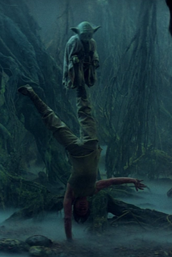

// #region settings
+++
title = "Советы от мастера Йоды для достижения успеха" 
draft = false
id = 8147174082143471515
publishdate = 2014-03-17T12:00:00+03:00
+++
include::https://cdn.jsdelivr.net/gh/pashkas/levelupblog/locale/attributes-ru.adoc[]
:doctype: article
:footer: nofooter
:leveloffset: 1
:encoding: utf-8
:lang: ru
:icons: font
:sectnumlevels: 0
:!figure-caption:
:!table-caption:
:imagesdir: https://cdn.jsdelivr.net/gh/pashkas/levelupblog/2014 - Советы от мастера Йоды для достижения успеха/
// #endregion

_Мастер Йода – http://nerdistway.blogspot.com/2014/02/blog-post.html[еще один всеми нами любимый вымышленный персонаж из вселенной фильма “Звездные Войны”]. Милый 700 летний старик, обладающий огромной внутренней силой и опытом в обучении юных джедаев, его мудрость и методика обучения, отточенная многими поколениями, достойна восхищения, и конечно же, мы, юные джедаи, желающие http://nerdistway.blogspot.com/2013/08/blog-post_5490.html[поднять свою жизнь на новый уровень], должны обратить внимание на его мудрость и взять на вооружение все лучшее, чему он может научить нас!_

++++
<!--more-->
++++

= Найди своего Йоду

Конечно он не обязательно должен выглядеть как Йода, но ты должен найти человека, который разбирается в чем-то намного лучше тебя. Для себя я понял, что нахождение наставника – это то, что необходимо, если ты хочешь наиболее быстро продвинуться в чем-то:

* *Если ты хочешь "подтянуть" математику* – найди парня, который в ней разбирается и на пальцах тебе ее объяснит, ответит на все твои вопросы. 
* *Хочешь стать шахматистом* – играй и общайся с ребятами, которые разбираются в этом лучше тебя! 
* *Ученым* – начни уважать своих учителей, построй с ними доверительное общение, изучай жизнь великих ученых! 
* *Хочешь стать лучшим игроком в Counter Strike* – общайся с ребятами, которые реально профессионалы в этом, задавай вопросы, старайся вступить в их клан! Спрашивай у них, на какие ошибки они натыкались, что было эффективно для них, попробуй пойти похожим путем!

Конечно, я не говорю о том, что невозможно найти свой путь и добиться чего-то самому, но принятие авторитета является наиболее быстрым, эффективным и простым способом. *Если этот человек смог – значит и ты тоже сможешь!*

_Возможно не всегда есть возможность лично общаться с человеком, но всегда есть возможность читать его книги, блог, слушать лекции, задавать вопросы по электронной почте…_

= Не пытайся. Делай или не делай. Попыток нет!

Просто делай что-то и постепенно ты достигнешь в этом мастерства! Тебе не нужен "идеальный план упражнений", не нужна "идеальная диета" и экипировка для того чтобы "стать джедаем". Все что тебе нужно - это делать то, в чем ты хочешь достичь совершенства без лишних размышлений.

_P.S. Ты наверное знайшь какой главный девиз у компании Nike – “Just Do It”! А в первоначальном варианте он звучал более жестко – http://habrahabr.ru/company/alconost/blog/182986/[«Just Frickin' Do It»—«просто, блин, сделай это»]._

*Не пытайся! Делай!*

= По размеру судишь меня ты?

image:xWing.png[]

_Помнишь как маленький старенький Мастер Йода смог с помощью своей внутренней силы поднять X-Fighter на глазах у изумленного молодого, хорошо сложенного и здорового Люка Скайоуокера?_

_http://nerdistway.blogspot.ru/2014/08/blog-post_28.html[К черту “Генетику”!]_

*Мы все разные…* _Да, Даже ты!_

Возможно тебе не очень повезло с ростом, склонностью к худобе, полноте, возможности быстро набирать мышечную массу. Возможно тебе не очень повезло с родителями и они не дали тебе хорошего образования и стартового капитала…

НО! У тебя точно есть возможности для того, чтобы улучшить положение дел!

Твоя внутренняя сила и упорство обязательно дадут свои плоды! И ты обязательно сможешь догнать и превзойти баловней судьбы!

*Планирование-труд-терпение*(_и может быть немного удачи_) обязательно принесут успех. В любом случае ты сможешь добиться того, чтобы стать лучше чем ты есть. Внутренняя сила и стремление это одно из самых важных качеств!

_Ты смотрел фильм Форест Гамп? Ты знаешь, что на протяжении веков понятие о человеческой красоте часто менялось координальным образом? Ты наверное в курсе того, что многие Французские актеры, которые далеко отходят от идеалов красоты являлись и являются любимцами женщин?_

Как часто можно видеть людей, которые имели все и ОПУСТИЛИСЬ?! Все таки я согласен с Альбусом Дамблдором:

“Пожалуй, наши поступки говорят о нас намного больше, чем наши способности…”

= Не поддавайся темной стороне силы

Темная сторона – отстой! Да, конечно http://nerdistway.blogspot.com/2014/02/blog-post.html[есть замечательные представители темной стороны силы, и там тоже есть чему поучиться], но для сегодняшнего урока мы примем, что темная сторона силы – это полный отстой!

Когда ты хочешь добиться чего-то, тебе предстоит выбрать, готов ли ты встать на путь Джедая _(упорный труд, преданность делу, здравый смысл, долговременный положительный результат)_ или ты пойдешь по более простому пути Темной стороны силы:

* Стероиды для набора мышечной массы
* Энергетики для временного повышения работоспособности
* Таблетки для улучшения здоровья 
* Модные диеты 
* Обман, подсиживание и шагание “по-головам”…

_Тебе не нужны добавки, не нужны таблетки, витамины, чудодейственные дорогостоящие системы, компьютерные программы и диеты, которые обещают нереальные результаты за 4 недели!_

В настоящее время темная сторона силы активно работает в фитнесс и медицинской индустриях. И она прогрессирует с ростом количества толстых и ленивых людей. Избегай рекламы коммерческих продуктов, которые обещают слишком быстро слишком хороших результатов для того чтобы быть правдой!

*Тебе нужен упорный труд и самоотверженность!*

= Используй светлую сторону силы!

_Вначале, когда я только начал работать над проектом http://nerdistway.blogspot.com/2013/07/mylife-rpg-organizer.html[RPG Organizer] и над этим блогом мне было чрезвычайно сложно. Но со временем, когда я начал получать благодарности от пользователей, я стал более воодушевленным, работа начала приносить удовольствие. Я стал видеть, что то, чем я занимаюсь, кому-то нужно, для кого-то важно. Теперь я не только делаю что-то для себя, я помогаю людям, и они благодарны. Это дает дополнительные силы, мотивацию, поддержку._

Найди свое предназначение. То, чем нравится заниматься и то, что будет полезно другим людям. Тогда эта деятельность будет даваться тебе легко, ты будешь чувствовать поддержку и огромное удовлетворение. Конечно, иногда будет сложно! Но у тебя всегда будут находиться силы для преодоления препятствий! К тому же ты постепенно заметишь, что вся твоя жизнь стала больше наполнена смыслом, и что с тобой чаще стали происходить хорошие вещи, ты станешь более удачливым человеком и станешь легче преодолевать проблемы.

*Это все - хорошая карма, Сударь! Попробуй!*

_Пересмотри фильм “Звездные войны – Эпизод 5” (если совсем нет времени, пересмотри только с 68 минуты, где Мастер Йода учит юного Скайуокера джедайскому мастерству), скажи, что ты думаешь об этом? Напиши в комментариях!_

