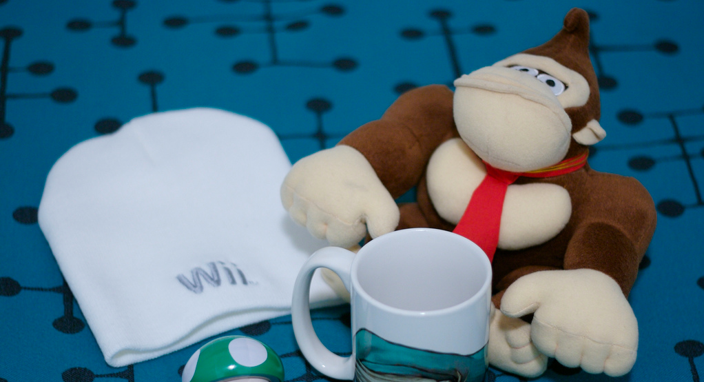
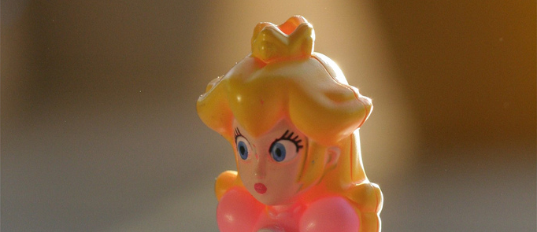
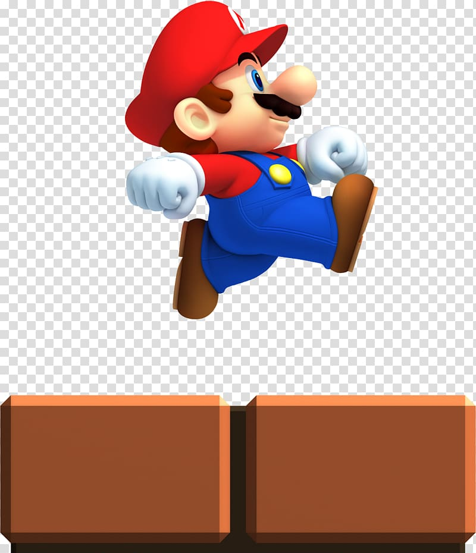

<!--
Title: Советы от Донки Конга по Level UP!
PostId: 
Published: true
-->

**Сегодня огромная виртуальная горилла подскажет тебе как надо быть в крутым.** 

Каждый из нас так или иначе играл в Донки Конг, верно? Если нет - вот небольшая предыстория: Донки Конг похитил принцессу и твоя задача, в роли Марио, подниматься по лестницам и преодолевать препятствия, пока не достигнешь вершины уровня, где она находится в плену.

Если ты до сих пор не понимаешь о чем это я, потрать 30 секунд на просмотр [этого небольшого видео](https://www.youtube.com/watch?v=EhFV5-qbbIw), а потом присоединяйся к разговору.

<!--more-->

# Кто твоя принцесса?

**Марио постоянно рискует жизнью взбираясь по неисправным лестницам, уклоняясь от катящихся бочек и спасаясь от надоедливого огня.** Зачем? Потому что его подруга была схвачена чертовой грязной обезьяной, и он - ее последняя надежда! Бьюсь об заклад, если бы ты был на месте Марио, ты бы поступил также.

**Взгляни на свою жизнь и свои цели... Что для тебя является "Принцессой"?** Почему ты хочешь быть крутым и добиться чего то классного? Если ты скажешь - "*почему бы и нет?!*" или "*ну все говорят, что нужно... бла, бла, бла*", ты вероятно не будешь прыгать через горящие обручи и бочки, чтобы оказаться там поскорее.

Зато если ты скажешь "*я бы хотел быть здоровым и видеть как мои дети растут*" или *"я хочу особняк на собственном острове"* или "*я хочу произвести хорошее впечатление на ту симпатичную девушку из кафешки*" или "*я хочу чтобы мне нравилось как я смотрюсь в зеркале*", я тебе поверю. Держу пари, ты действительно сделаешь шаги, чтобы перевернуть свою жизнь. Ответь себе честно на вопрос - [чего ты действительно хочешь](https://nerdistway.blogspot.com/2017/05/5.html)? Какой бы не была "твоя принцесса", помни об этом каждый день, особенно в те дни когда разбит и готов сдаться..

# У тебя есть конкретная цель?

Подруга Марио ждет наверху уровня, а это значит, что Марио должен решить несколько конкретных проблем, чтобы спасти ее. Каковы твои конкретные цели?

- Похудеть на 10 кг.
- Устроиться на хорошую работу с зарплатой 100500 тысяч.
- Отправиться на Филиппины и заснять с квадракоптера, как плывешь на каноэ по океану.

В зависимости от того как далеко ты находишься до конечной цели, может быть немного разная сложность уровня, но точно, если цель будет КОНКРЕТНАЯ ([как квест в твоей любимой игре](https://nerdistway.blogspot.com/2013/08/blog-post.html)), ты будешь помнить, почему преодолеваешь все эти препятствия и сколько еще нужно пройти.

# Прыгай или мочи!

Путь Марио от нижнего края экрана к верхнему - нелегкая прогулка. Ему приходится уклоняться от всякого мусора, типа бочек, которые наш злодей в него швыряет. К счастью наш Марио - крутой сантехник-акробат и он может с легкостью справиться с препятствиями на пути к своей цели просто перепрыгнув их. Или взять супер молот и мочить!

**Что является бочками в твоей жизни?** Это препятствия, появление которых можно предсказать, но которые сразят тебя, если ты не будешь к ним готов. Например такие:

**1) Суперсрочный проект на работе.** В прошлом в такие стрессовые моменты ты всегда обжирался пиццей, забивал на свои планы по [Level Up](https://nerdistway.blogspot.com/2013/07/mylife-rpg-organizer.html), снимал стресс сигаретами/алкоголем и подстегивал себя литрами кофе.

- **Прыгай.** Постарайся делать маленькие незаметные перерывы, чтобы привести голову в порядок. Найди немного времени, чтобы по человечески поесть. В конце концов, смирись, но не унывай. И пообещай себе, что снова вернешься в строй, как только эти нелегкие дни кончатся.
- **Мочи!** В преддверии тяжелой рабочей недели приготовь порции нормальной еды на весь период. Осознавая всю важность ставь в приоритет свои цели, но работай эффективнее, чтобы все успеть. Отдохнешь чуть позже...

**2) Праздники/пирушки.** В предыдущие недели ты старательно питался и занимался спортом чтобы скинуть пару лишних килограмм, и у тебя даже что-то начало получаться! Но тут ожидается чей то ДР, куда тебя позвали, или встреча с друзьями на шашлыках, где будет море пива и грузовик мяса. Куда денется весь твой таким трудом достигнутый прогресс?

- **Прыгай.** Просто будь особенно внимателен к своему питанию в дни, предшествующие праздникам и тусовкам. Чисто математически один-два дня расслабона не могут перечеркнуть десятки дней усиленного труда.
- **Мочи!** Многие поколения люди не питались так "ровно" как мы сейчас. За пирами следовали голодные времена, а за ними снова пирушки и.т.д. После того как племя завалило очередного условного мамонта все обжирались несколько дней, затем собирались с силами еще какое-то время, а потом ждали новой удачи! Просто пропусти следующие 1-2 приема пищи и когда почувствуешь настоящий голод тебе будет очень легко вернуться к здоровому правильному питанию, а набранные за время тусовок лишние граммы легко уйдут подальше.

*Наша жизнь полна этих бочек.* Определи свои и составь план игры, как будешь с ними справляться. Будь готов, планируй заранее, а затем ПРЫГНИ или КРУШИ!

**Что произойдет если тебе заденет одна из них?** Дерьмо случается, и иногда ты будешь [садиться в лужу](https://nerdistway.blogspot.com/2017/08/blog-post.html). Мы все люди, а [игра жизни](https://nerdistway.blogspot.com/2013/08/blog-post_5490.html) непроста. К счастью, если ты *буквально* не попал под гигантскую бочку, ты можешь встать и попробовать еще раз (ооооооооооооооооо). Итак, если ты под действием обстоятельств ел как свинья, пил как рыба, и тренировался как Джабба Хат, кого это волнует?

Поставь будильник на пораньше, вытащи свою задницу и вернись в нужное русло. Принцесса не спасет себя сама.

# Не стой на месте!

Пока Марио взбирается по лестницам, прыгает через бочки и хватает молоты, внизу разгорается это маленькое пламя. Оно слабенькое и неуклюжее, но в конце концов оно догонит Марио, если тот будет стоять на месте.

Стоя на месте и просто справляясь с текучкой ты не станешь круче. Пора двигаться вперед. [Будь сегодня лучше чем вчера](https://nerdistway.blogspot.com/2017/05/blog-post_1.html) - сильнее, быстрее и увереннее. Найди способ сделать одно лишнее повторение в упражнениях, выучить на одно иностранное слово больше, прочитать на одну страницу больше или написать еще одно предложение для своей книги.

*Всегда повышай свой уровень и двигайся вперед.*