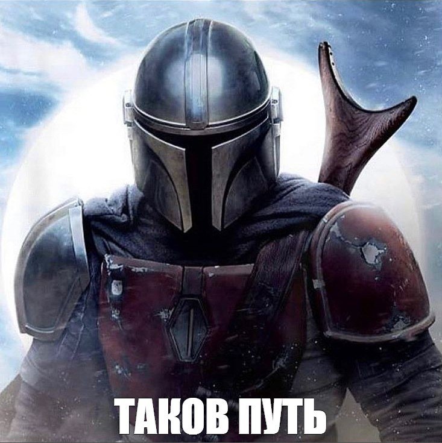
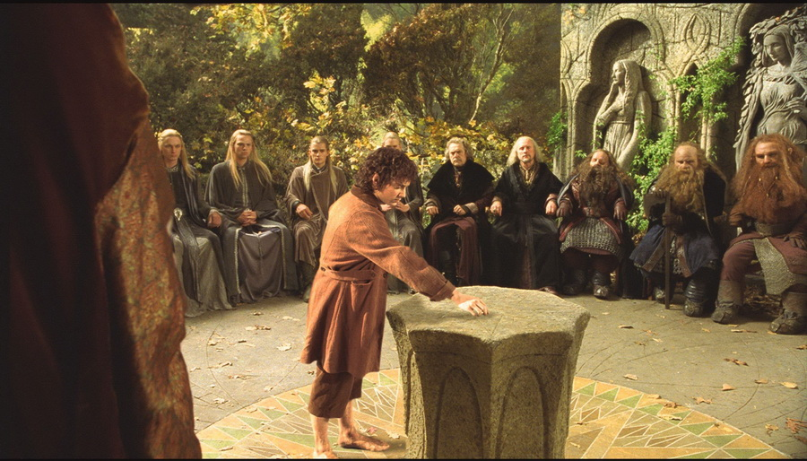
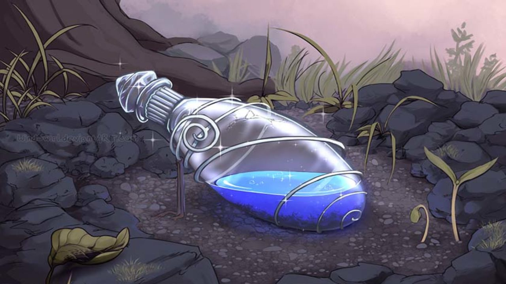

<!--
Title: Таков путь
PostId: 
Published: true
-->

Думаю, что для тебя не секрет, что мы, ботаны, часто сталкиваемся с такой штукой, как "паралич выбора". Он заключается в том, что слишком большое количество возможных вариантов парализует нашу способность сделать выбор.

Куча вариантов диет, упражнений, подходов к управлению своим временем и самосовершенствованию, инструментов или компьютерных программ для творчества (*главный прикол в том, что все они работают, если им следовать какое-то время*)... Чем больше у нас возможностей, тем более вероятно, что мы не будем делать ничего, выбирая идеальный вариант.., или же будем метаться от одного крутого способа что-то сделать к другому, стоя на месте на самом деле.

<!--more-->

## Выбери свой путь

Помнишь эпизод "Властелина Колец", когда на совете, что делать с Кольцом Всевластия, было невозможно сдвинуться с места до тех пор, пока Фродо не принял решение самому отнести его на Роковую Гору? Все варианты имели плюсы и минусы, каждый был чем-то хорош, по своему, а может быть не очень. Нужно было принять какое-то решение и работать с ним, чтобы действовать.

Я очень хорошо знаком с этим. Особенно я столкнулся с такой проблемой, когда делал [РПГ Органайзер](https://nerdistway.blogspot.com/2013/07/mylife-rpg-organizer.html):

- Я постоянно менял варианты ролевых моделей, добавлял казалось бы нужные функции и фишки.
- Добавлял настройки, пытаясь переложить выбор как пользоваться прогой на пользователей.
- Я принимал решение, и вроде бы все отлично работало, но когда я сталкивался с какими-то сложностями, то пытался вносить в свои планы кардинальные изменения и часто начинал все с начала.
- Я кучу раз сталкивался с людьми, которые загорались, предлагали миллион хороших идей (*не очень нужных мне*), я их реализовывал, но после этого они теряли интерес и сливались. А я считал, что все было плохо, сбивался, терял мотивацию.

В итоге я частенько находился в депрессии, или начинал сомневаться в те моменты, когда все шло хорошо, и тогда все рушилось. Но после того, как я сделал выбор - все изменилось. Ограничил все тем, что нужно мне, остановился на том, что мне нравилось. Решил для себя, что так - отлично, теперь стоит пользоваться своим решением. У меня появилось куча сил и энергии, улучшилось настроение, а я стал концентрироваться на том, как решать конкретные проблемы, а не переживать из-за правильности своих идей или оглядываться на чужое мнение.

Просто пойми, многие дороги ведут к хорошему результату, просто надо им следовать и не сворачивать:

- В упражнениях есть куча нюансов, куча вариантов, но ты не поймешь их до тех пор, пока не сделаешь выбор, с чего начать и что для тебя правильно.
- В питании многие диеты работают, и каждая принижает достоинства другой, выбери то, что подходит тебе и придерживайся этого какое-то время.
- Многие крутые ребята пишут офигенные компьютерные программы "в блокноте", а писатели - ведут офигенные блоги тоже "в блокноте". Не зацикливайся слишком на средствах.

## Твой запас Маны

Представь, что у тебя, как в игре, есть некоторый запас "Маны", который ты расходуешь на то, чтобы побудить себя к действиям. Если ты принял какие-то решения заранее, то этот запас не расходуется, ты просто делаешь что-то, что решил раньше. Если тебе нужно постоянно принимать решения в любых ситуациях - этот запас быстро расходуется и ты уже не можешь его использовать, когда действительно будет нужно.

Все мы помним суровых принципиальных Мандалорцев из одноименного сериала... Может быть они не очень гибкие в своих действиях, но КОДЕКС позволяет им быть эффективными и не размышлять долго там, где нужно быстро действовать.

Зацени, сколько энергии нужно тратить, если у тебя нет принципов:

- Прозвонил будильник... Вставать, или полежать еще немного?
- Умываться и чистить зубы? Или не сегодня?
- Сразу пойти на работу/учебу, или поныть немного?
- Позавтракать в МакДональдсе или дома?
- Питаться сегодня 3 раза или 6 раз? Как полезнее?
- Жирная еда полезная или вредная?
- Желтки от яиц полезные или вредные?
- Делать эти упражнения, или те? Может попробовать что-то новое? Может не делать никаких упражнений?
- В тренажерке заниматься на тренажерах или со свободными весами? Или поотжиматься дома? Сколько подходов и повторов делать?

Нет ничего плохого, чтобы иногда быть немножко роботом, и экономить моральные силы для нужных моментов. Человек, у которого есть принципы имеет больше преимуществ, чем тот, кто болтается из стороны в сторону. Когда ты уже сделал заранее большинство решений:

- Ты знаешь, чем ты будешь заниматься и знаешь как будешь это делать.
- У тебя больше сил и энергии, которые можно потратить на решение творческих задач.
- У тебя лучше настроение, каждый день у тебя есть небольшие достижения, которым ты радуешься.
- Может быть ты прогрессируешь медленнее, чем мог бы, но ты всегда идешь вперед и не сдаешься.

## Как выбрать путь

Просто проделай следующее:

1. **Выбери вопрос.** Например, в какое время заниматься спортом.
2. **Выбери несколько вариантов.** Например, заниматься спортом можно утром, а можно днем или вечером.
3. **Откинь те, что тебе не подходят.** Предположим, днем заниматься лучше всего, но ты не можешь. Тогда не будем изучать этот вариант, будем считать, что он плохой. Забудем про него.
4. **Какой тебе больше нравится?** Вот просто подумай, что тебе ближе... Например, заниматься рано утром. Примерь на себя. Комфортно?
5. **Найди подтверждение эффективности своего варианта.** Например, Дуэйн Скала Джонсон любит заниматься очень рано утром, хотя другие чуваки говорят, что это очень не правильно и не эффективно. Ну и фиг бы с ними, ведь Дуэйн Скала Джонсон круче чем они все. Если это может быть для кого-то эффективным и тебе нравится, значит это круто и тебе подходит. Давай попробуем?
6. **Прими решение.** Представь, что будешь так делать. Нормально?
7. **Следуй пути.** Теперь забудь про этот. Перестань сомневаться. Теперь ты будешь делать так и на ближайшее время нет других вариантов. Главное - прими решение. Может быть оно будет не правильным, но по крайней мере ты не будешь бездействовать и сможешь его поправить ([как Дарт Вейдер](https://nerdistway.blogspot.com/2014/02/blog-post.html)). Позже.
8. **Выбери следующий вопрос.**

После того, как ты ответишь на все главные вопросы для себя, жить станет проще и веселее. И тебе будет яснее виден Твой Путь.

## Два режима

Представь, что у тебя есть два режима - режим планирования и режим действия. 

Если ты постоянно находишься в режиме планирования (*большинство ботанов*), у тебя не будет сил, чтобы что-то делать. Давай возьмем РПГ игры в качестве примера (*[ведь они являются отличным руководством для достижения целей](https://nerdistway.blogspot.com/2013/08/blog-post_5490.html)*).

В режиме планирования:

- Ты [выбираешь себе квест](https://nerdistway.blogspot.com/2013/08/blog-post.html)
- Собираешь необходимую информацию
- Набираешь команду
- Затариваешься эликсирами и вооружением
- Выполняешь квест - получаешь награду

Режим планирования действует непродолжительное время. В режиме планирования ты не производишь каких-то активных действий.

В режиме действий:

- Ты сражаешься с противниками.

Режим действий более продолжительный, чем режим планирования. Режим действий не требует каких-то принципиальных размышлений о правильности своего выбора, бренности бытия и.т.д. Ты просто используешь свои навыки, совершенствуешь персонажа, получаешь удовольствие от процесса и у тебя все получается! 

Также и в реальной жизни... Выдели время, чтобы поразмышлять. Определи чего ты хочешь, как планируешь этого достичь, поизучай разные варианты, выбери тот, который кажется тебе правильным... Действуй, не оглядываясь назад. [Не надо пытаться. Делай или не делай.](https://nerdistway.blogspot.com/2013/12/blog-post_25.html)

Конечно, размышляй над своими принципами иногда, когда узнаешь что-то новое или обстоятельства изменятся, но...

## Не торопись

В какой-то момент ты примешь окончательное решение и теперь нужно выждать время, чтобы посмотреть как оно работает:

- Не меняй ничего в своих тренировках по крайней мере 6 недель, за меньшее время твоя программа может не успеть проявить себя.
- Не меняй ничего в своем питании по крайней мере 4 недели, а потом посмотри, устраивают ли тебя результаты.
- Не берись за новую пачку личных проектов, пока не доделал предыдущие. Или прими решение окончательно забросить их.
- Пока что-то нормально работает, не трогай это (1-е правило сисадмина)...

Весь прикол в том, что в любом случае ты будешь сталкиваться с какими-то сложностями в своей жизни. Иногда ты будешь отчаиваться, иногда перегорать, но тебе вовсе не нужно каждый раз разворачиваться на 180 градусов, встречая препятствие.

В общем, не меняй свои решения слишком часто. Конечно, иногда стоит задуматься, переосмыслить все, сменить парадигму... Но помни, что люди, которые достигают чего-то стоящего, редко меняют свои решения и большую часть времени находятся в режиме действия, а не планирования.

**Таков путь.**