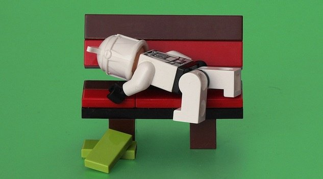
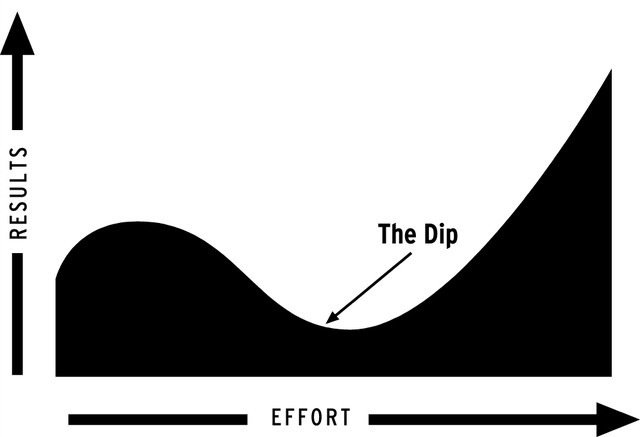
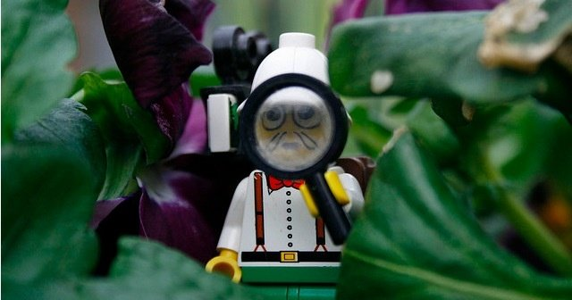
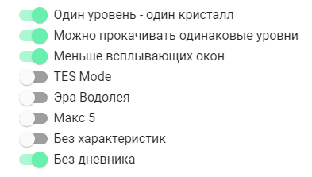
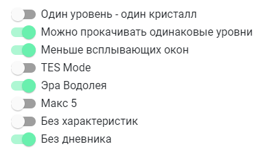
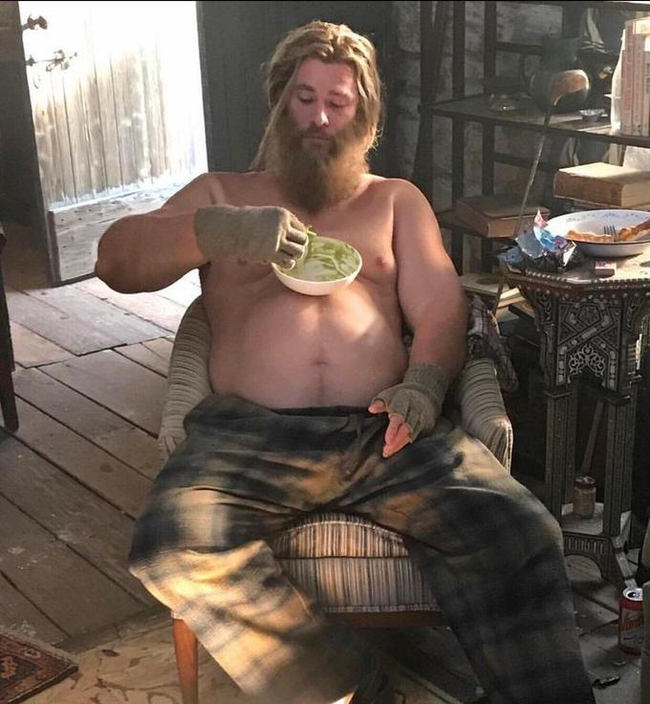

<!--
Title: Ты перегорел? Что делать?
PostId: 
Published: true
-->

*Рано или поздно это случается с каждым из нас. Последние несколько недель у тебя все перло, ты был мотивирован и уверен, что у тебя все будет получаться. Тренировки ты ждал с нетерпением, дела щелкал как орешки, но что то произошло. Нет, тебе не лень заниматься спортом, даже хочется, но получается все как то не так. Становится очень сложно повторить то, что с радостью ты делал еще вчера, не говоря уже о каком-то прогрессе. Ты слабак и у тебя нет силы воли? Теперь Game Over и пробовать попозже начать все сначала?.*

<!--more-->

# Отлови момент

Вовремя поймай момент, когда начинаешь перегорать. Если ты сделаешь это вовремя, сможешь восстановиться достаточно быстро. Нет - пройдут недели, а то и месяцы, прежде чем все снова будет нормально.

Задумайся, если:

- Ты сильно устаешь, но тебе тяжело уснуть
- Ты готов делать что-то, но тебя это не радует
- Падает мотивация
- Плохое настроение
- Тебе совсем не лень, но ты чувствуешь какую-то слабость
- Ты начал худеть, хотя нормально питаешься
- У тебя плохой аппетит
- Учащенное сердцебиение
- Кружится голова, снижается либидо (это уж точно не пропусти)

# Не вини себя

Попасть в состояние спада абсолютно нормально, ты в этом не виноват. Когда мы начинаем что-то новое, мы можем быстро прогрессировать и все классно, потому что мы видим большие изменения. Но через какое-то время прогресс замедляется, потом останавливается, а то и откатывается назад. Когда получаешь такой спад, легко сдаться и сказать: *"Я неудачник"*.

Не правда.

**Мы все испытываем спад, когда дело доходит до прогресса в важных для нас вещах.**

[Это как уровни в ролевой игре.](https://nerdistway.blogspot.com/2013/08/blog-post_5490.html) Вот ты прокачал персонажа и жизнь великолепна - мобы лопаются как воздушные шарики, а боссы с большим трудом изображают какое-то подобие сложности. Но тут ты переходишь в другую локацию и ты снова лох. До тех пор пока не прокачаешь персонажа до следующего уровня.

**Не унывай, помни, что перед подъемом часто идет спад. Это как перестройка тебя для твоего нового уровня.**

*Все мы достигли плато в нашей жизни и в поисках здоровья и счастья . Чтобы добиться успеха в решении поставленной задачи, нам нужно пройти через эту нижнюю точку (или плоскую точку), пока мы не сможем выбраться и продолжить продвижение.*

Может быть, сегодняшний день такой, и завтра будет по другому, а может быть твои

# Выясни, почему это произошло

Может быть ты не ходил в отпуск последние 3 года? Или жестко планировал КАЖДЫЙ свой день, практически не оставляя свободного времени? Пытался одновременно сесть на диету и увеличить сложность упражнений? Слишком быстро добавлял веса в тренажерке? Слишком часто занимался? Взял слишком много обязательств и поставил жесткие сроки? А может быть просто не выспался и сегодня плохая погода?

Оглянись назад, определи, ЧТО и КОГДА пошло не так, чтобы оттянуть следующий момент облома (*а он будет*) как можно дальше и сделать его слабее.

# Возьми долбанный перерыв

В некоторых РПГ (*например Baldur’s Gate и Morrowind*) даже если ты набрал необходимое количество очков опыта до следующего уровня, твои навыки и характеристики вырастут только после того, как твой персонаж "поспит". Так и ты - сделай уже долбанный перерыв!

Ты уже понял, почему перегорание с тобой случилось, теперь нужно что-то делать. А точнее НЕ ДЕЛАТЬ.

Прежде чем ты реально впадешь в состояние глубокой депрессии, попробуй искусственно ввести себя в такое состояние, но не забывай, что ты играешь в игру по своим правилам!  Доведи ситуацию до абсурда!

Веди себя так, как будто заболел, например, легкой простудой. Попробуй взять отгул на работе на денек. Пару дней полежи, укрывшись пледом. Попей сладкий чаек в компании хорошего сериальчика или книги. Забей на дела. Ты не должен быть эффективным в эти дни! Ты восстанавливаешься. Подожди пару дней, если все придет в порядок и ты нова будешь рваться в бой (часто бывает так) - отлично!

# Не помогает?

Тогда, скорее всего - Game Over. Внутри тебя перегорел какой-то физический или моральный предохранитель. Тебе нужно какое-то время на восстановление, может пара недель, может месяц. Затем вернись к самому началу своего геройского приключения, когда ты поднимал минимальные веса в тренажерке, читал по одной страничке в день, занимался зарядкой по 5 минут... Но это не страшно. В этот раз тебе будет намного проще и  ты быстро вернешься в форму. Чтобы в следующий раз не обломаться или по крайней мере зайти дальше... 

# Не повторяй ошибок

Пойми, что ты становишься круче не во время упражнений, а  момент восстановления после них. Хорошо питайся, хорошо спи. Не бери на себя слишком много, не прогрессируй слишком быстро.

Просто для прикола, ознакомься с тем, как преодолевают такие проблемы спортсмены. Вот, например, [хорошая книга Майка Мейнцера](https://www.koob.ru/menttcer_maik/), бодибилдера, который доказал, что более редкие и короткие тренировки могут быть чрезвычайно эффективными. Попробуй воспринимать эту книгу не только как простой гайд по спорту, а как руководство по жизни в целом. Да, [иногда меньше значит больше](https://nerdistway.blogspot.com/2014/12/blog-post.html)!

Если пользуешься [РПГ Органайзером](https://nerdistway.blogspot.com/2013/07/mylife-rpg-organizer.html), попробуй другие настройки. На самом деле на волне оптимизма очень легко схватить "перетрен", но можно несколько замедлить прогресс, если тихо ехать, дальше быть лучше подходит для тебя.

Например вот так прогресс будет максимально медленным, примерно по одному очень маленькому изменению в день. Так у тебя будет достаточно времени для морального или физического привыкания к прогрессированию. Такой олдскульно-восточный подход к развитию, когда ты приходишь в школу кунг-фу, но первый год обучения Учитель просто заставляет тебя носить воду и мыть полы в зале)))

А вот так - сначала изменится количество получаемых очков навыков за каждый уровень и стоимость прокачки навыков. Сначала ты будешь прогрессировать достаточно быстро, а в критические моменты, вроде добавления новой привычки или прокачки на высоких уровнях, прогресс будет замедляться. Каждый уровень ты будешь получать 10 очков навыков. Открытие навыка стоит 10 очков, прокачка 1 уровня стоит 1 очко, 2-го 2, ... 9-го 10. Эта система слизана с [замечательной настольной игры "Эра Водолея"](https://rpg.fandom.com/ru/wiki/%D0%AD%D1%80%D0%B0_%D0%92%D0%BE%D0%B4%D0%BE%D0%BB%D0%B5%D1%8F). Можешь найти в интернете книжку и почитать, чтобы глубже погрузиться в то, какие РПГ механики существуют и даже поиграть со своими детьми/младшими братьями или сестрами. Многие вещи в РПГ Органайзере взяты оттуда. К тому же при такой настройке достаточно интересно, я именно так сейчас пользуюсь.

Не пытайся быть крутым и активным всегда. Будь полегче с собой. Чисто математически одна пропущенная тренировка не перечеркнет недели стараний, один поход в Макдональдс не перечеркнет недели правильного питания. Давай себе время восстановиться, хотя бы в выходные. Планируй свой отдых, чтобы снова не попасться в [ожидаемую ловушку обстоятельств](http://nerdistway.blogspot.com/2020/09/level-up.html):

- 80% времени ты усиленно работаешь, 20% - безбожно халтуришь
- 80% упорно тренируешься, 20% лежишь на диване, укрывшись пледом и поедаешь мороженное
- 80% работаешь над проектом, 20% играешь в Диабло
- 80% охотишься, 20% - пируешь
- 80% сражаешься, 20% - развлекаешься в таверне
- 80% спасаешь принцесс, 20% - проводишь время с ними

Но пожалуйста, всегда возвращайся на путь героя. Даже Тор иногда срывается, но он все еще достоин!

