// #region settings
+++
title = "Новая Киллер Фича РПГ Органайзера" 
draft = true
//id = 2660611215266768037
publishdate = 2020-03-06T12:00:00+03:00
+++
include::https://cdn.jsdelivr.net/gh/pashkas/levelupblog/locale/attributes-ru.adoc[]
:doctype: article
:footer: nofooter
:leveloffset: 1
:encoding: utf-8
:lang: ru
:icons: font
:sectnumlevels: 0
:!figure-caption:
:!table-caption:
:imagesdir: https://cdn.jsdelivr.net/gh/pashkas/levelupblog/2020/03/06/Новая Киллер Фича РПГ Органайзера/
// #endregion

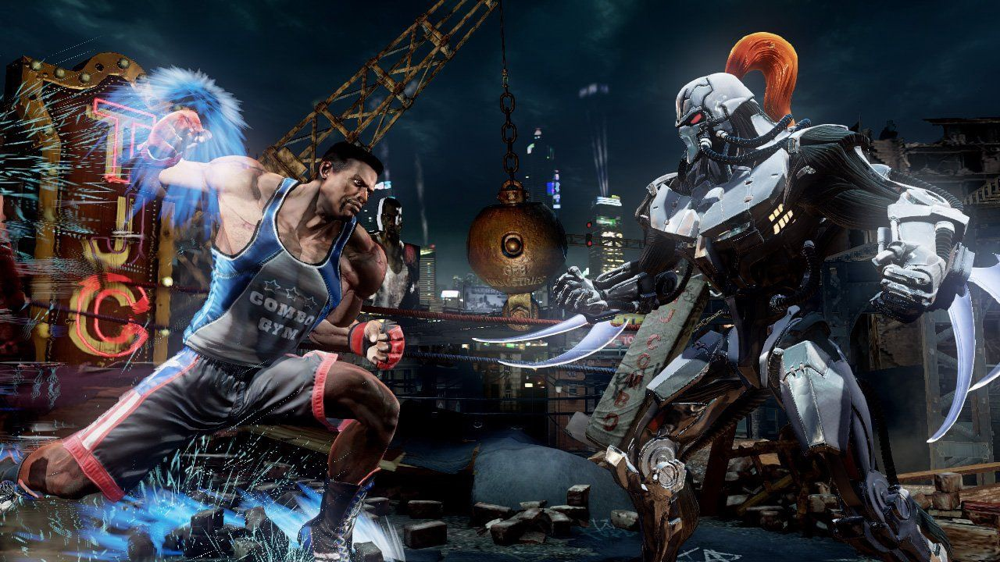

Ура! У РПГ Органайзера появилась новая Киллер-фича! Это - УМНЫЙ дневник.

Идея https://vsevolodustinov.ru/blog/all/ezhednevny-lichny-chek-list/[взята отсюда]. Зацени, как прикольно... Все что ты сделал сегодня и что пропустил из своего списка отмечается в РПГ органайзере с привязкой к конкретному дню. Затем ты можешь указать какие-то индивидуальные параметры, по которым ты можешь оценивать как влияет то, что ты делал на них. Ну там - запас маны, HP, магический урон (шучу!). И так ты сможешь видеть во-первых, насколько эффетивно то, что ты делаешь, во-вторых - в правильном ли направлении ты движешься, в-третьих - если эти параметры будут расти - создаст дополнительную мотивацию!

= Как пользоваться

Итак, на экране персонажа появилась вкладка "дневник":

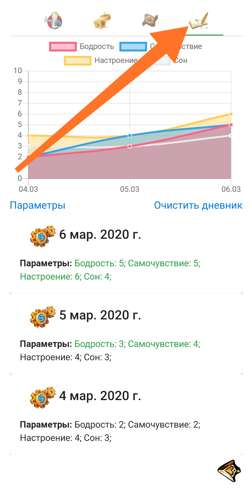

Туда каждый день будет добавляться новая запись (но не больше 28-ми дней), куда автоматом будут записываться дела, которые ты сделал (также можно будет внести дополнительные заметки) и можно будет оценить этот день по каким-то критериям.

Чтобы добавить критерии оценки - щелкни по ссылке "параметры":

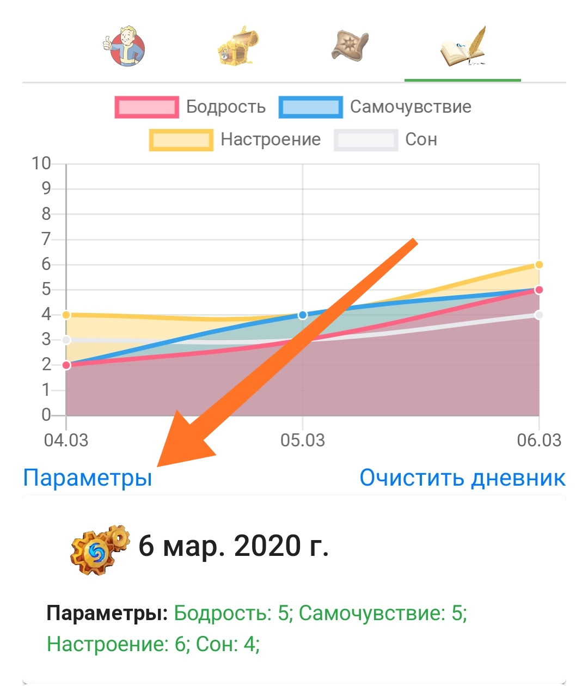

А затем добавь туда критерии:

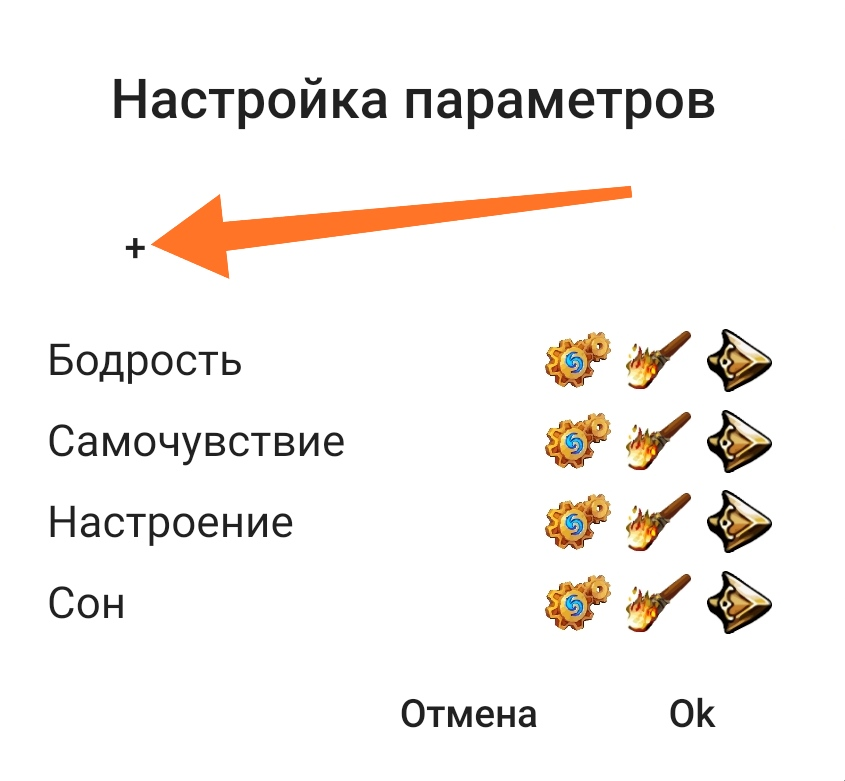

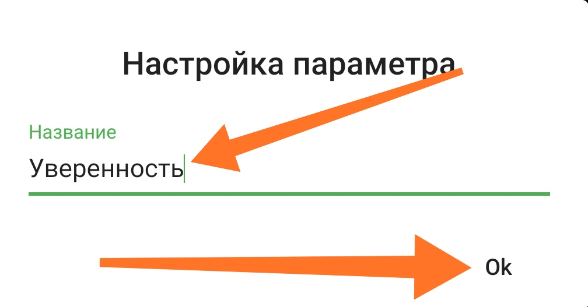

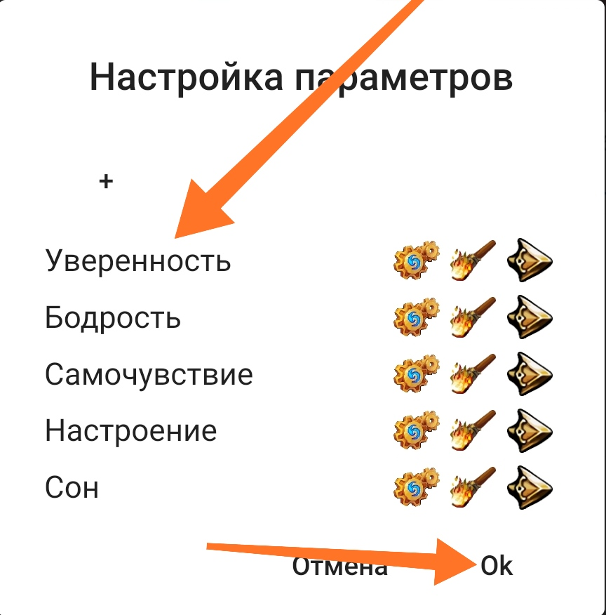

В конце нажми "ОК". Параметры будут добавлены во все записи дневника.

Теперь ты можешь нажать на редактирование записи дневника:

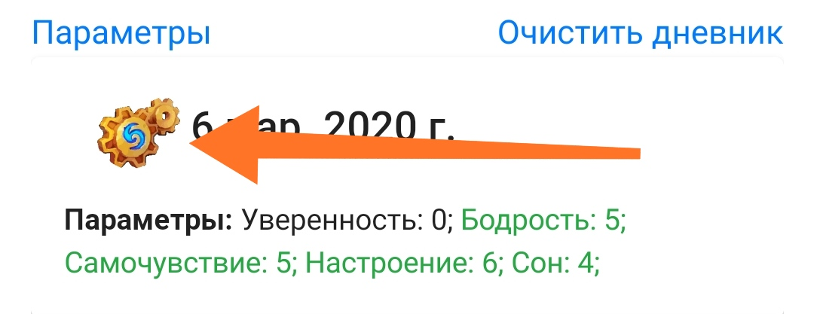

Там ползунками укажи значения параметров за конкретный день (от 0 до 10). И нажми "ОК".

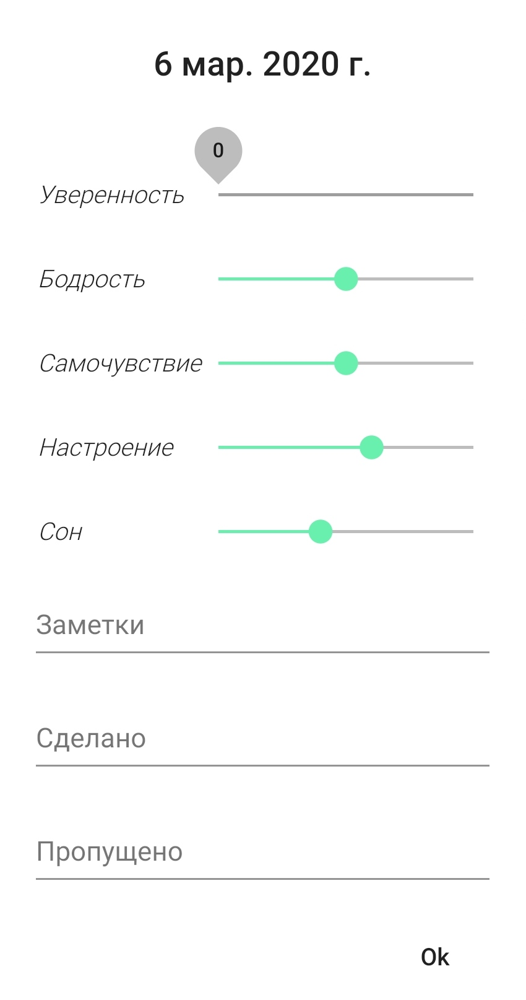

Отлично! Параметры оценены, и ты можешь увидеть как они меняются на шикарном графике!

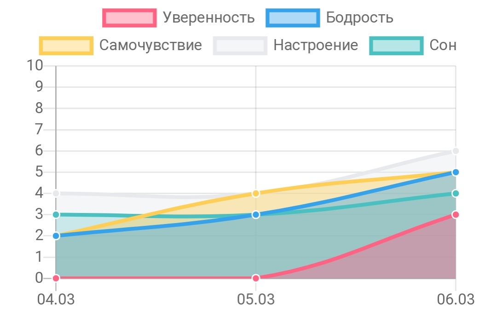

Параметры на графике можно фильтровать - тыкай по легенде:

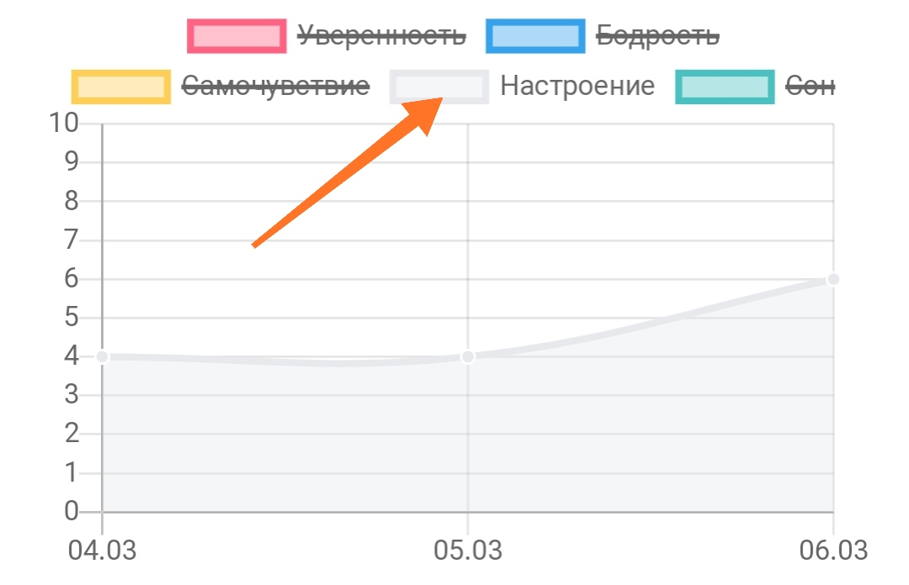

Чтобы оценивать параметры за сегодняшний день - есть удобная фишка - прямо из главного окна сделай долгий пресс по картинке перса:

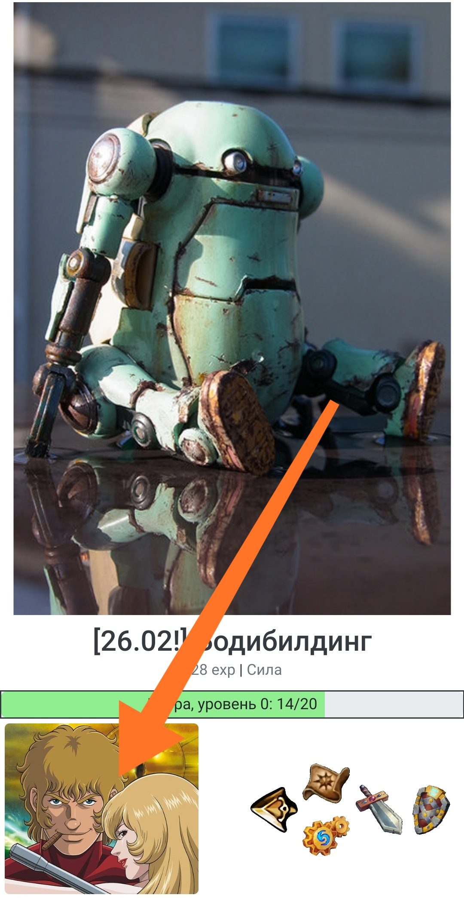

И откроется окно настройки дневника за сегодняшний день!

= Получить РПГ Органайзер

Если ты законопослушный гражданин - то сначала https://blogspot.us14.list-manage.com/subscribe?u=98515752cf454f1f654734adc&id=9dcba274e3[подпишись на мой блог], и тебе прийдет письмо с подробными инструкциями.

Если нет - перейди в https://pashkas.github.io/rpgorganizertutorial.github.io/[руководство РПГ Органайзера], там все подробно описано, или сразу по https://rpgorganizer-72d0b.firebaseapp.com/#/main[этой ссылке] (но лучше ознакомиться с руководством). 

https://blogspot.us14.list-manage.com/track/click?u=98515752cf454f1f654734adc&id=c537fc49af&e=298532c011[Но лучше всего начать отсюда, если ты новичок!]

= Сохрани ссылку на РПГ Органайзер

Если планируешь когда то пользоваться РПГ Органайзером - сохрани эти ссылки:

- https://rpgorganizer-72d0b.firebaseapp.com/#/main[РПГ Органайзер]
- https://pashkas.github.io/rpgorganizertutorial.github.io/[Инструкция]

Потому что через некоторое время, как у меня дойдут руки, все ссылки на РПГ Органайзер из этого блога будут удалены и ты сможешь их узнать только подписавшись на рассылку статей блога.

= Обратная связь?

Знаешь, было бы очень классно если бы ты рассказал(-рассказала) в комментариях о своем опыте использования РПГ Органайзера. Что понравилось? Что не понравилось? Что отталкивает от использования? В чем возникли трудности? Все ли нормально работает? Буду премного благодарен!

И поздравляю всех девушек с наступающим праздником! ))))