// #region settings
+++
title = "РПГ Органайзер - еще одна киллер фича" 
draft = false
publishdate = 2020-03-17T12:00:00+03:00
id = 2227418488144313056
+++
include::https://cdn.jsdelivr.net/gh/pashkas/levelupblog/locale/attributes-ru.adoc[]
:doctype: article
:footer: nofooter
:leveloffset: 1
:encoding: utf-8
:lang: ru
:icons: font
:sectnumlevels: 0
:!figure-caption:
:!table-caption:
:imagesdir: https://cdn.jsdelivr.net/gh/pashkas/levelupblog/2020/03/17/РПГ Органайзер - еще одна киллер фича
// #endregion

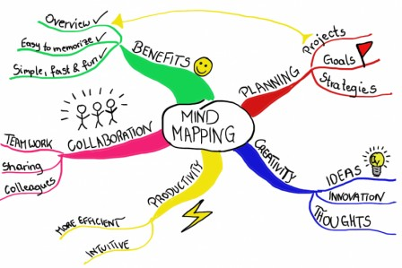

В РПГ Органайзере появилась еще одна офигенная фишка, которую я давно хотел сделать - Mind Map (карта персонажа).

Mind Map, или "карта ума" - эта такая классная штука, которая помогает организовать свои мысли. Подробнее про это можно https://lifehacker.ru/chto-takoe-karta-myslej-i-kak-s-nej-rabotat/[почитать тут]. Получается отличная вещь, чтобы в творческом стиле создать своего неповторимого аватара)))

++++
<!--more-->
++++

= Как пользоваться

На экране персонажа в самом низу появилась такая ссылка, нажми на нее:

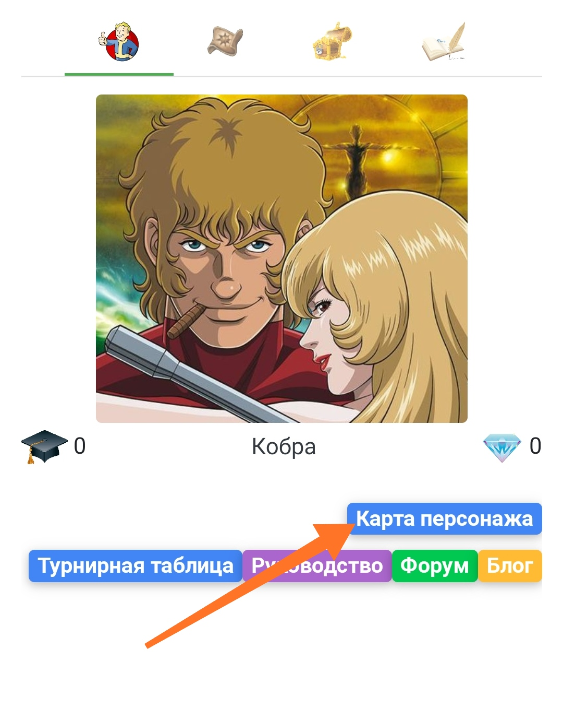

В центре будет твой персонаж. Кликни по нему и нажми "добавить":

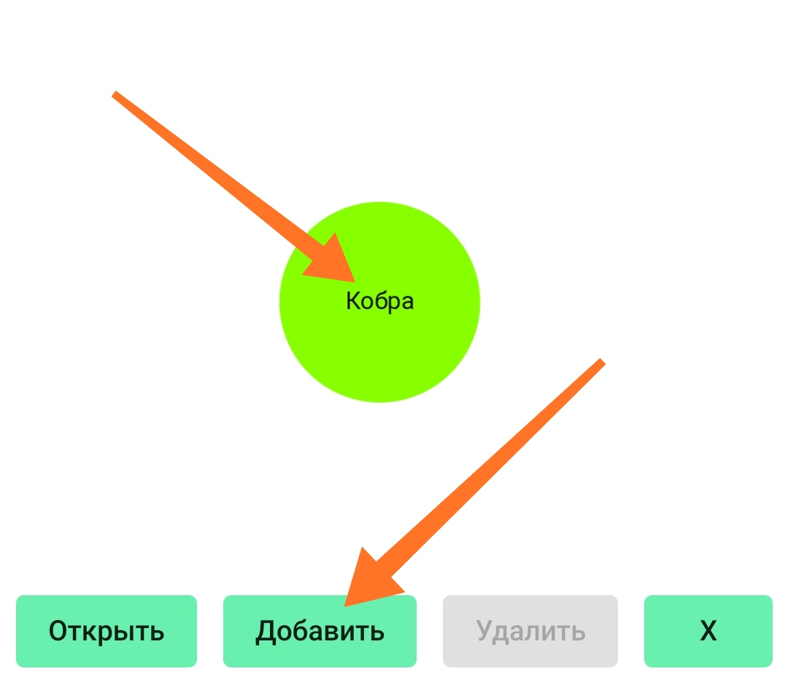

Если ты нажал "добавить", выделив перса, добавятся характеристики (нужно будет написать их название):

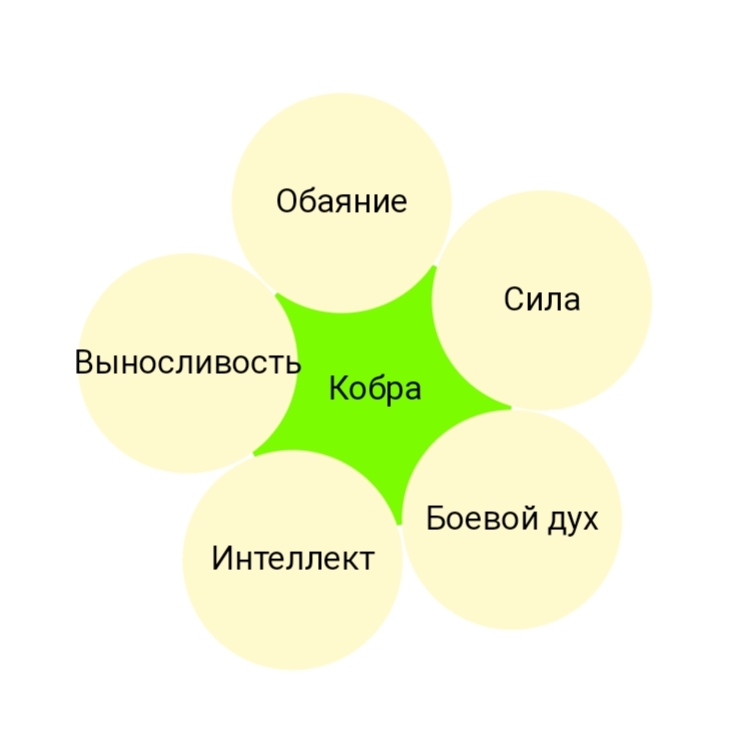

Теперь щелкни по характристике и тоже нажми "добавить". Добавь таким образом навыки:

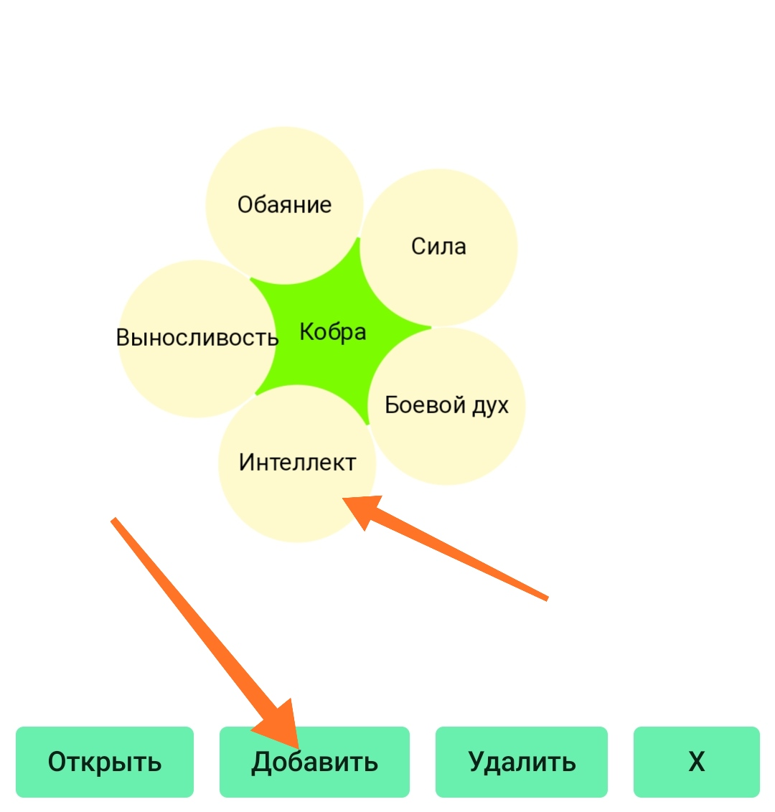

В итоге получится такая штука:

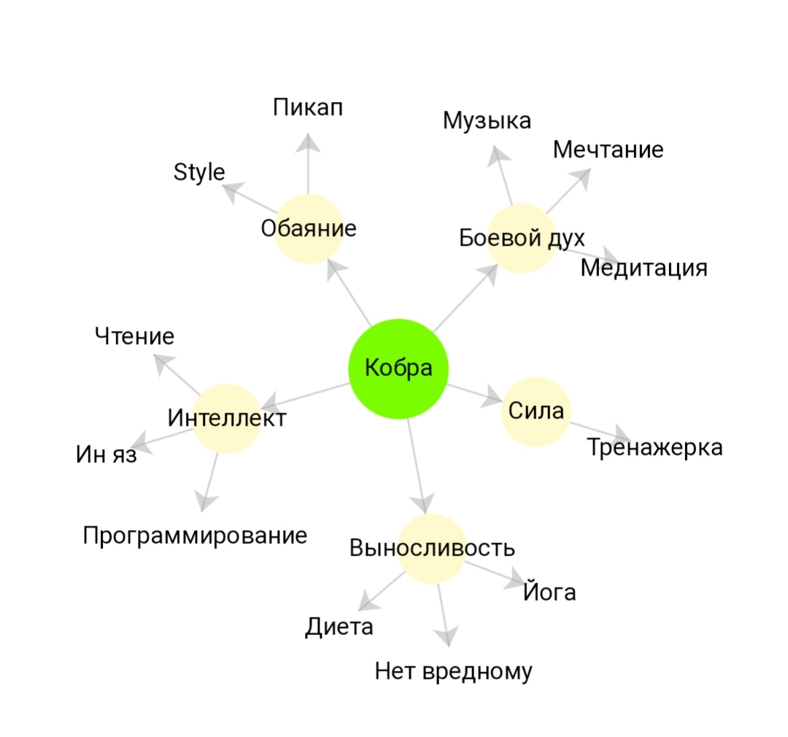

Все, что было настроено, перенесется также и на твоего персонажа:

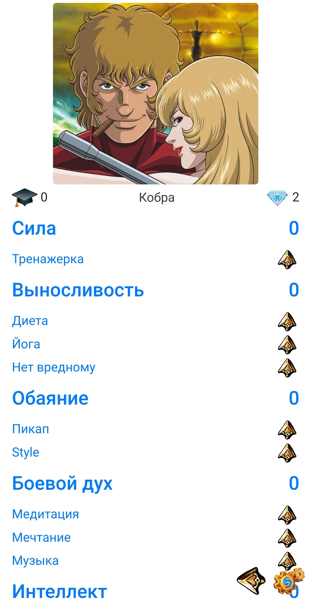

Еще можно настроить взаимосвязь между навыками. Типа навык нельзя "открыть" до тех пор, пока другой не будет прокачан до нужного уровня (это настраивается в настройке задач):

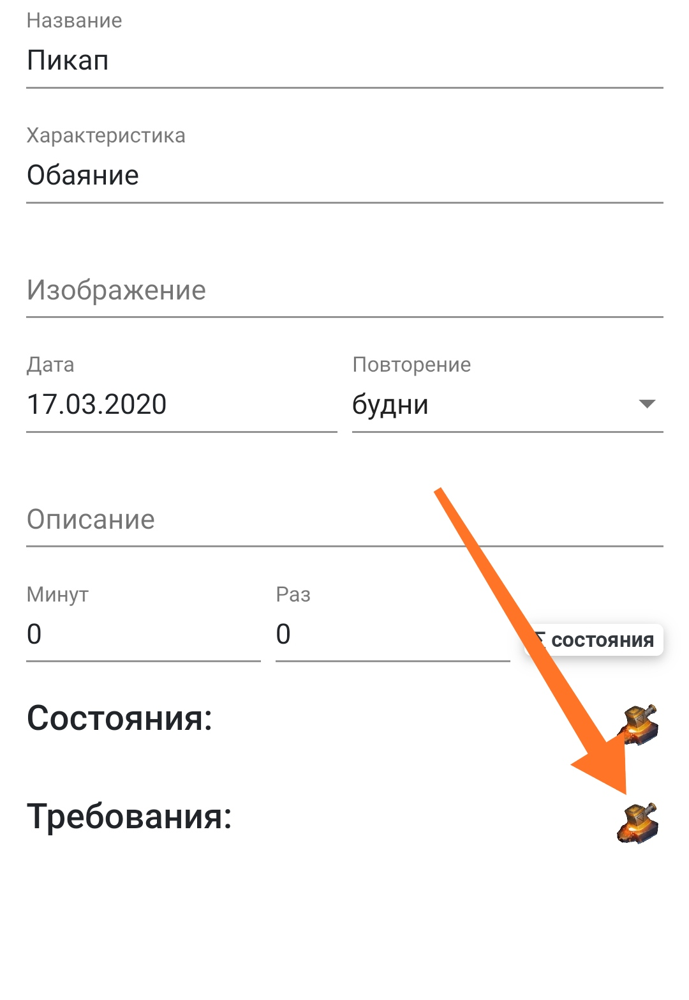

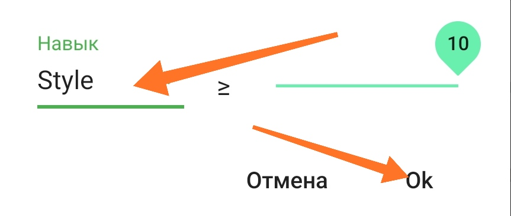

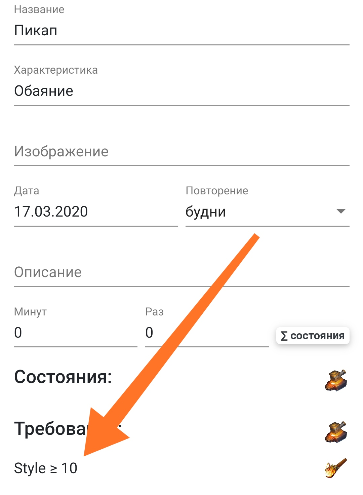

И эта связь тоже отобразится на карте персонажа (получается еще и как дерево навыков):

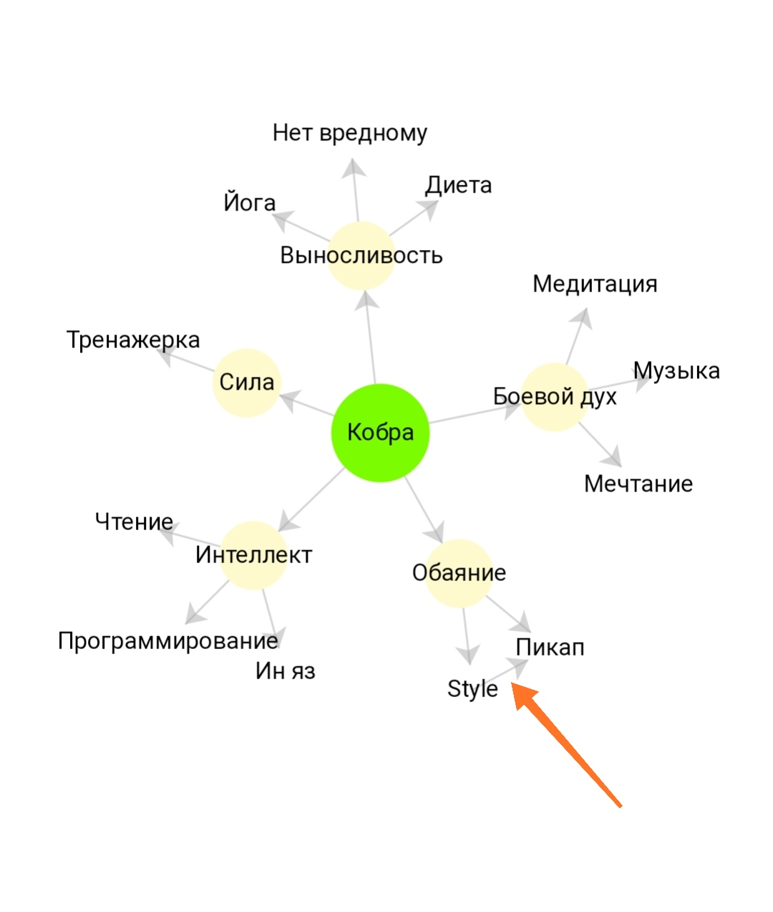

Также ты можешь на карте персонажа открывать и удалять элементы (выходит полноценный мастер персонажа):

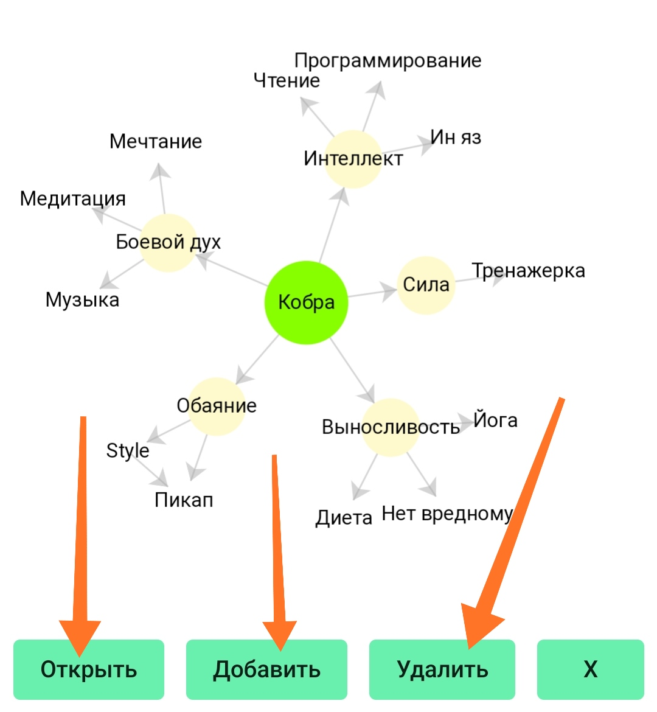

= Настройки баланса

Обрати внимание, в этой версии добавлено одно правило (для более плавной прокачки) - если следующий уровень навыка такой же, как и предыдущий, то нужно первым делом прокачивать именно этот навык.

Ну, короче если не настроена "плавность" прокачки. Вроде как следующий уровень нужно делать столько же минут, или столько же раз, он - такая же задача как и предыдущий. Тогда сначала нужно прокачать его. Раньше это просто подсвечивалось зеленым, а теперь обязательно.

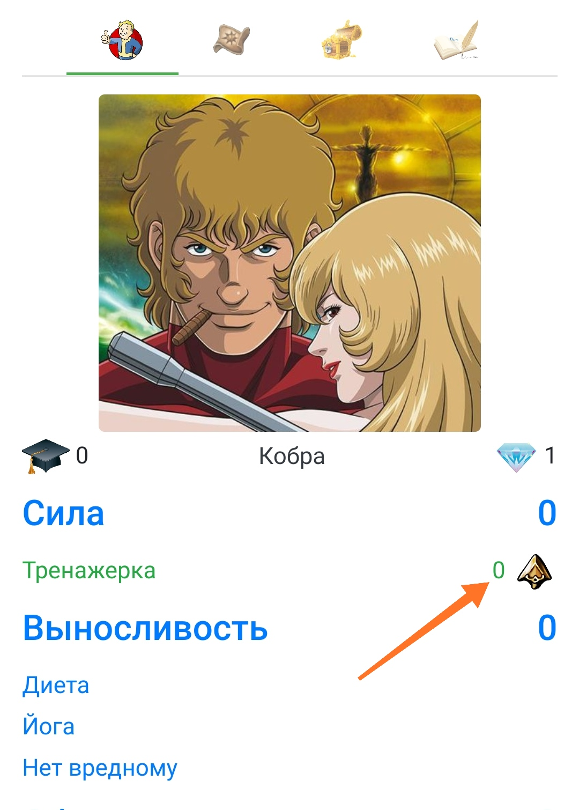

И еще - навыки теперь начинаются с нулевого уровня. Сначала ты на 1 кристалл "открываешь" навык, он становится "открытым" нулевого уровня, потом за доп. кристаллы ты его дальше прокачиваешь.

= Упростить

Также ты теперь можешь убрать некоторые вещи, которые могут быть для тебя лишними. Например, характеристики. Тогда у перса не будет характеристик, а будут только навыки. Или убрать функционал "дневник". Перейди на экран персонажа в режим редактирования и там:

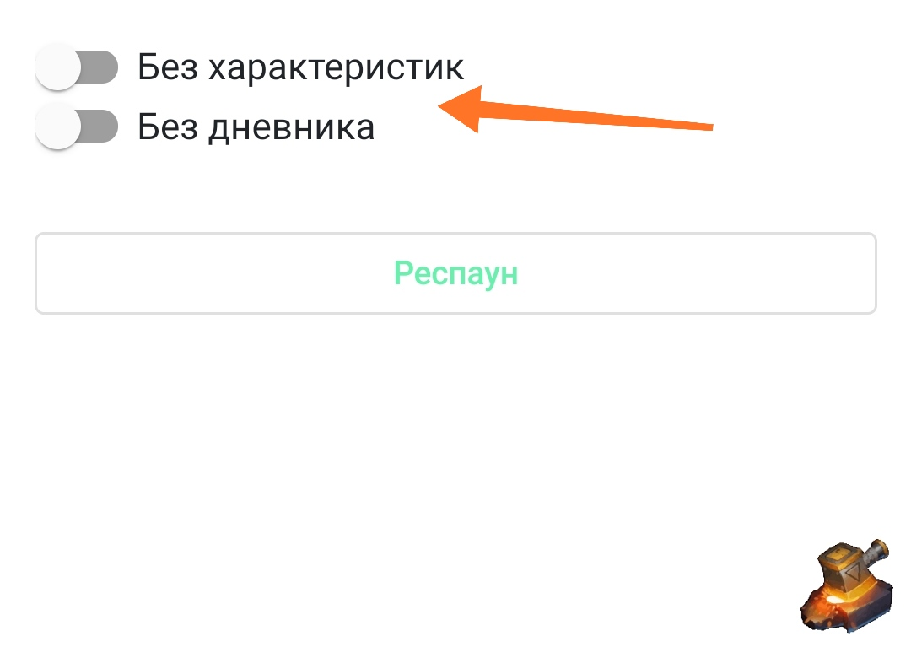

= Как получить доступ к РПГ Органайзеру?

Также как и раньше)))

Если ты законопослушный гражданин - то сначала https://blogspot.us14.list-manage.com/subscribe?u=98515752cf454f1f654734adc&id=9dcba274e3[подпишись на мой блог], и тебе прийдет письмо с подробными инструкциями.

Если нет - перейди в https://pashkas.github.io/rpgorganizertutorial.github.io/[руководство РПГ Органайзера], там все подробно описано, или сразу по https://rpgorganizer-72d0b.firebaseapp.com/#/main[этой ссылке] (но лучше ознакомиться с руководством). 

https://blogspot.us14.list-manage.com/track/click?u=98515752cf454f1f654734adc&id=c537fc49af&e=298532c011[Но лучше всего начать отсюда, если ты новичок!]

= Твой шаг

Напиши мне, что бы ты еще хотел увидеть в РПГ Органайзере? Как сделать РПГ Органайзер полезным для тебя? Какие сложность с использованием или почему он не кажется тебе полезным?