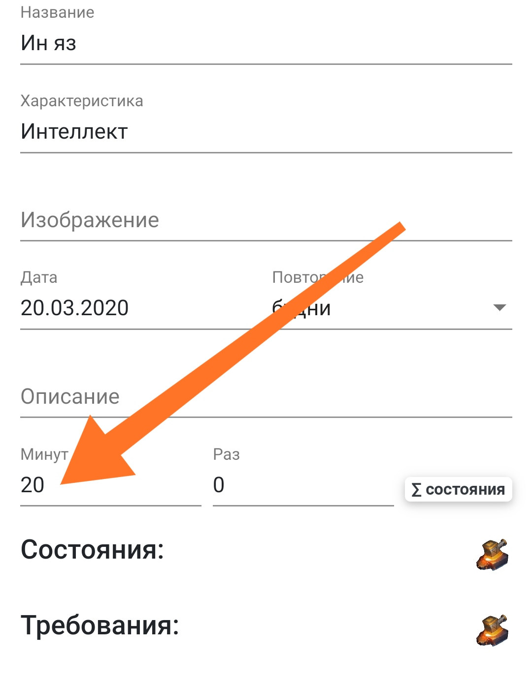
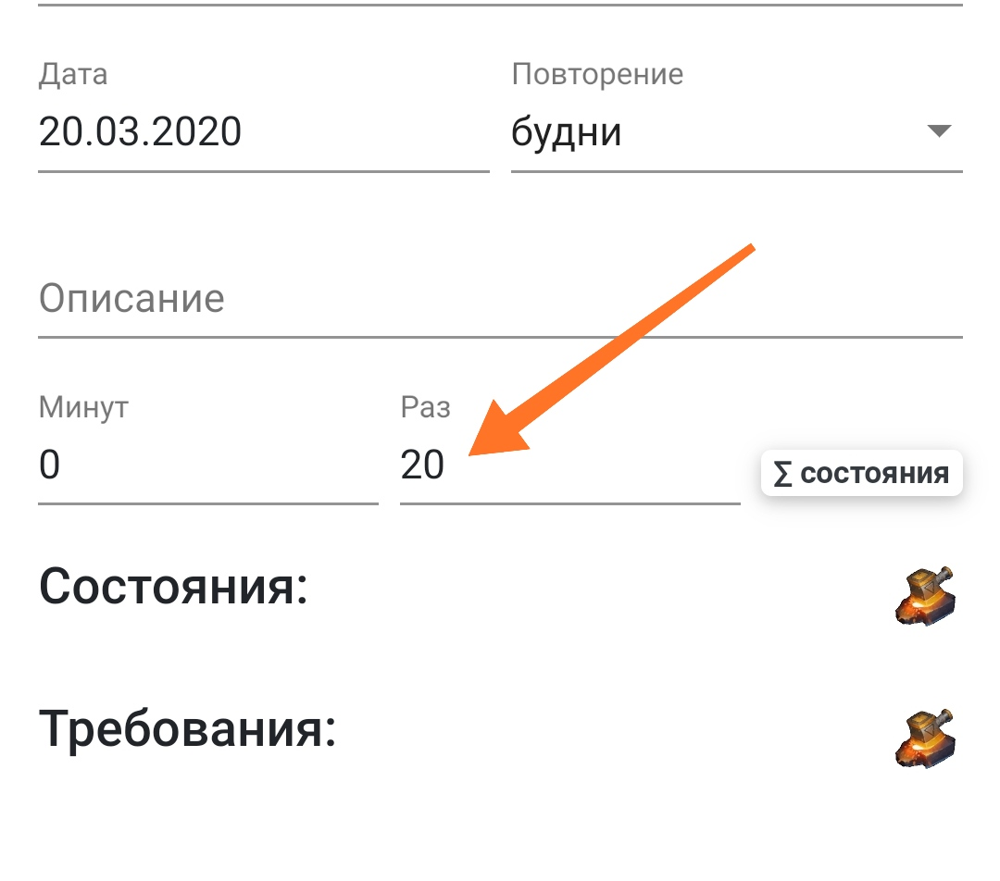
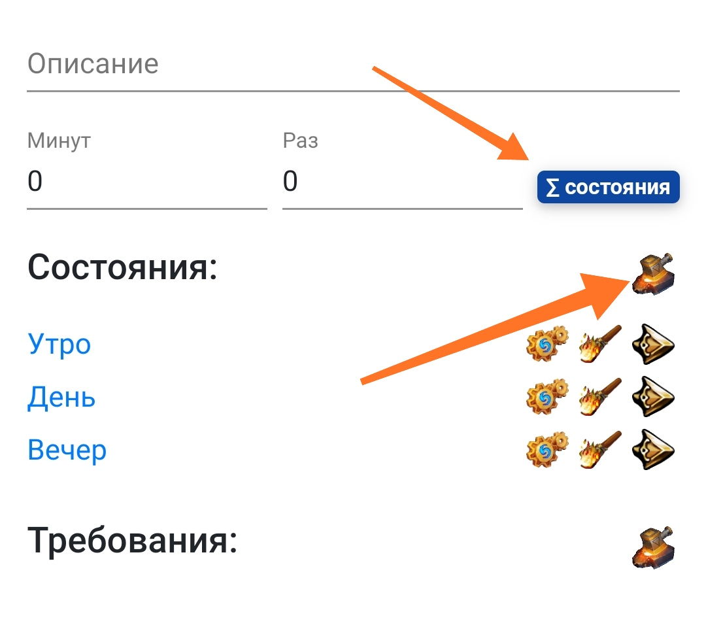
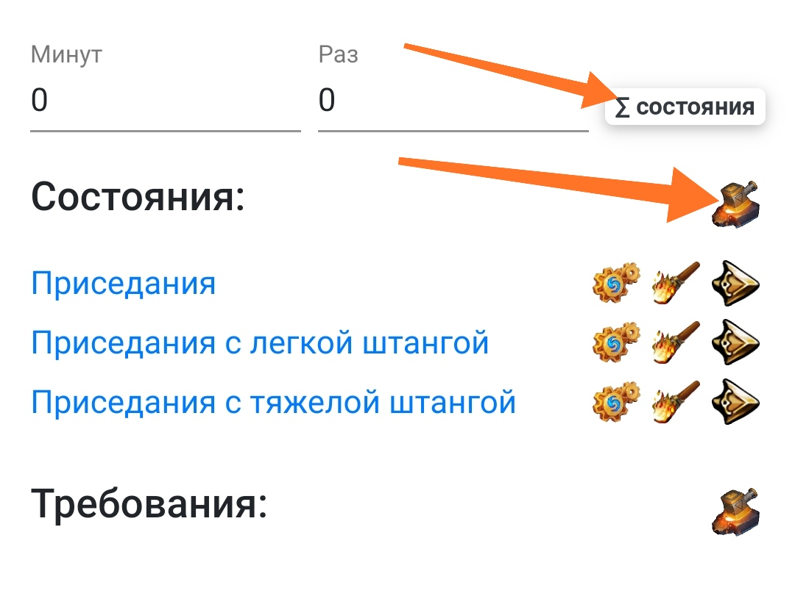
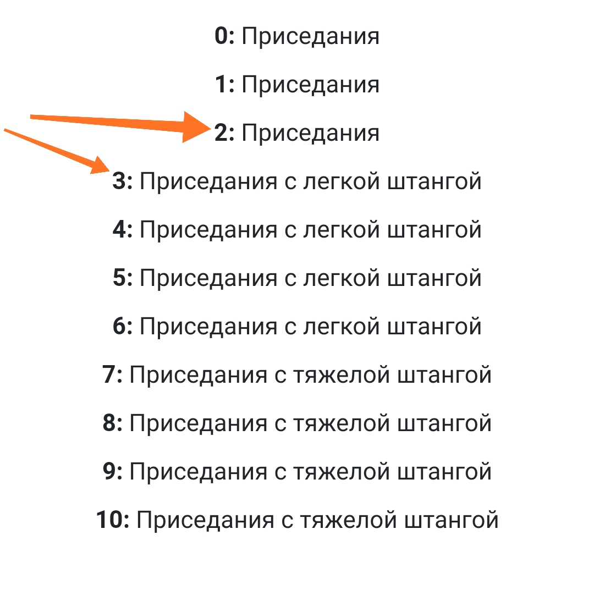
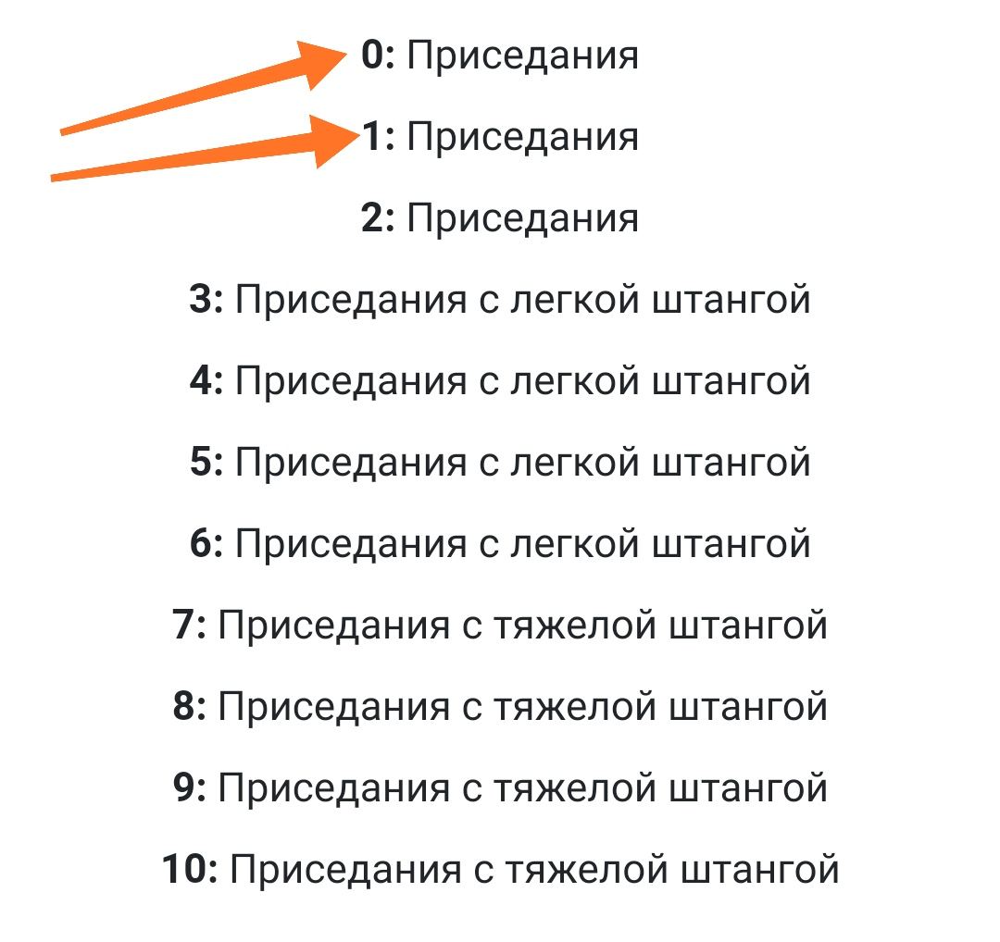
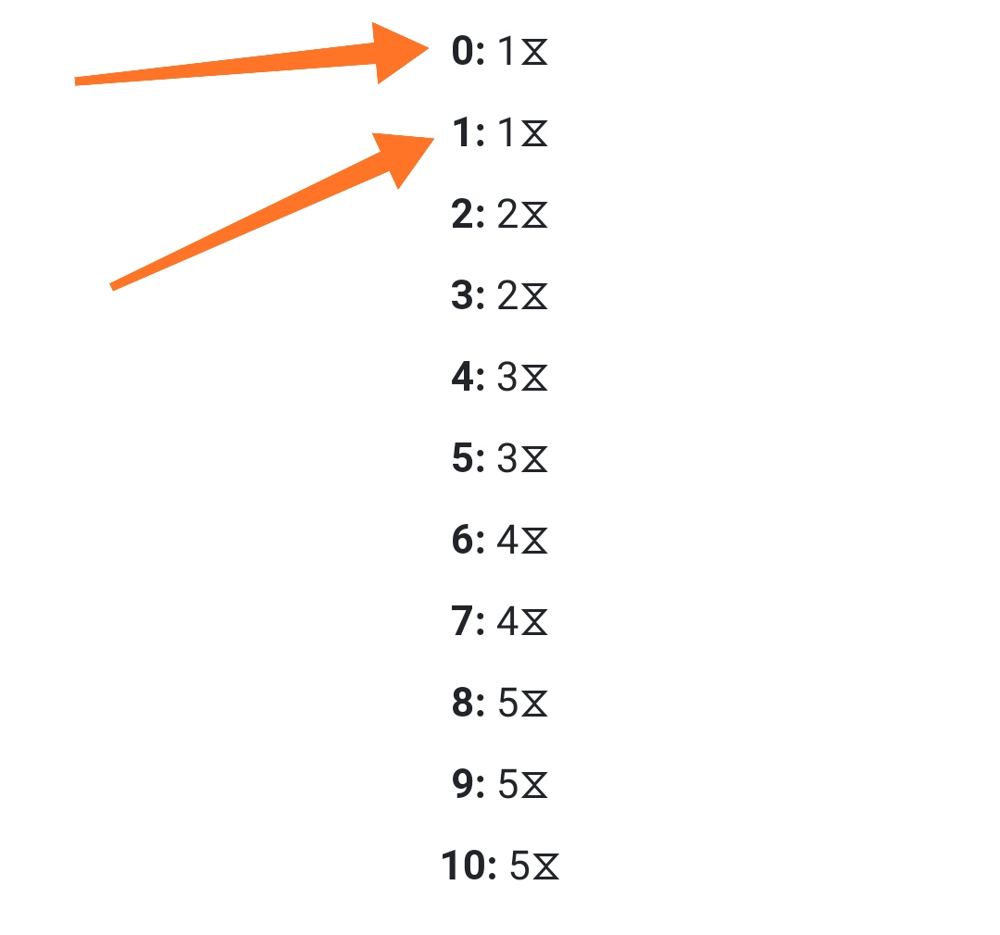
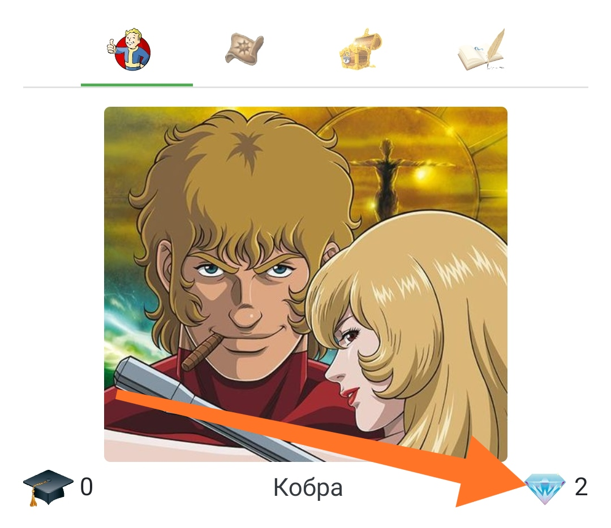
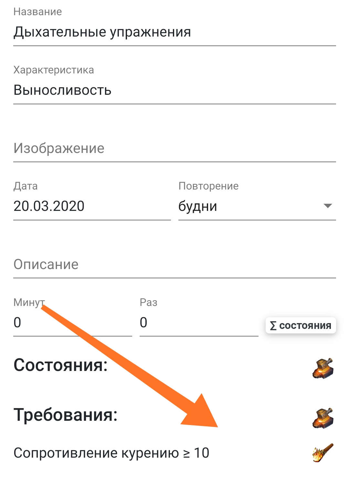

// #region settings
+++
title = "РПГ Органайзер - подробно про навыки" 
draft = false
id = 788832190896540721
publishdate = 2020-03-20T12:00:00+03:00
+++
include::https://cdn.jsdelivr.net/gh/pashkas/levelupblog/locale/attributes-ru.adoc[]
:doctype: article
:footer: nofooter
:leveloffset: 1
:encoding: utf-8
:lang: ru
:icons: font
:sectnumlevels: 0
:!figure-caption:
:!table-caption:
:imagesdir: https://cdn.jsdelivr.net/gh/pashkas/levelupblog/2020/03/20/РПГ Органайзер - подробно про навыки
// #endregion

Навыки - самое сложное понятие в РПГ Органайзере, а так как по поводу них есть много вопросов, в этой статье я постараюсь написать все, что про них знаю )))

++++
<!--more-->
++++

Чтобы прокачивать персонажа в РПГ Органайзер (и себя тоже) - нужно развивать навыки.

От развития навыков прокачиваются характеристики персонажа (ну и твои там... сферы жизни, качества и.т.д.).

Каждый навык преобразуется в периодически выполняемую задачу, выполняя эти задачи ты будешь получать *очки опыта*. С ростом очков опыта будет расти *уровень персонажа*. С каждым новым уровнем ты будешь получать *очки навыков*, на которые ты сможешь повышать уровни навыков. Чем больше уровень навыка, тем больше опыта дают его задачи.

= Уровни навыков

Каждый навык делится на 11 уровней. От 0 до 10. Сначала навык "не открыт", его задачи не попадают на панель задач.

Чтобы его открыть, нужно потратить 1 кристалл навыков. После того, как он будет открыт, его задачи будут попадать на панель задач.

Каждый навык в идеале нужно развивать постепенно. Начав с чего то простого (поначалу просто приобрести привычку заниматься чем то полезным каждый день), постепенно наращивая сложность. Потому что поначалу нужно тратить очень много силы воли на то, чтобы просто начать делать что-то определенное. Со временем тебе будет проще побудить себя к действию и тут уже можно усложнять сами дела. Например - ты хочешь преобрести навык "чтение книг". Сначала читаешь по 1 странице в день (это легко и очень просто себя заставить сделать это). Потом, когда это будет постепенно входить в привычку, можно будет ставить перед собой новые цели - 2 стр, 5 стр, 20 стр и.т.д.

Чтобы настроить такую постепенность - сначала определи, в чем измеряется крутость навыка (как в играх, например - меткость стрельбы, величина урона от файербола и.т.д.)? 
* *В минутах (1)*, например чтение, медитация или писательство
* *В количестве раз (2)*, например отжимания, подтягивания, количество выученных иностранных слов, выпитых стаканов воды и.т.д. 
* *В количестве дополнительных задач (3)*, например в начале ты будешь соблюдать диету только утром, а потом утром+днем+вечером.
* *В разных видах задач (4)*, например - сначала просто приседания, потом с легкой штангой, потом с тяжелой, потом - на одной ноге...

После того, как ты определил в чем измеряется навык, можно настроить постепенность его освоения. Перейди в режим редактирования и заполни для каждого случая следующие поля:

(1) Навык измеряется в минутах (нужно указать целевое значение, к которому в идеале стремишься - остальное рассчитается автоматом):

(2) Навык измеряется в количестве раз:

(3) Навык измеряется в дополнительных задачах (убедись, что кнопка "задачи суммируются" включена):

(4) Задачи навыка меняются (убедись, что кнопка "задачи суммируются" отключена):

Если сделаешь эти настройки, то с каждым уровнем навыка его задачи будут меняться, усложняться. Ты настроил уровни навыка. Если нет, задачи этого навыка всегда будут одинаковыми.

Уровни разные:

Уровни одинаковые:

Иногда, в зависимости от того, что ты внесешь в "целевые значения", некоторые уровни навыка тоже будут одинаковыми, например так:

= Прокачка навыков

Как я говорил, навыки открываются и увеличиваются за кристаллы навыков:

Если ты открыл или развил навык до какого-то уровня, и его следующий уровень будет другим, то ты можешь свободно развивать другие навыки (если будут кристаллы), а потом когда освоишься - перейти на следующий этап в этом навыке:

Если следующий уровень навыка такой же:

То другие навыки нельзя развивать до тех пор, пока не прокачаешь навык до такого уровня, когда следующий будет отличаться от текущего. Тогда иконка прокачки остальных навыков будет недоступна.

Зачем такие сложности? Чтобы сделать увеличение сложности максимально ПЛАВНЫМ. Иначе ты наберешь кучу задач и твоя психика не успеет с этим справиться, ведь приобретение привычек это достаточно сложный процесс. Исходи из того, что если сложность задач следующего уровня навыка такая же, как и предыдущего, то при получении нового уровня персонажа этот навык нужно "закрепить".

= Взаимосвязь

Иногда тебе может понадобиться сделать такую настройку: "навык Х можно развивать только после того, как освою навык У". Например, чтобы "дахательные упражнения" можно было осваивать только после "сопротивления курению".

Тогда в навыке "дыхательные упражнения" настраиваешь требования, в которые добавляешь "сопротивление курению":

Тогда навык "дыхательные упражнения" нельзя будет открыть или прокачать до тех пор, пока не будет освоен навык "сопротивление курению".

= Доступ к РПГ Органайзеру

Также как и раньше)))

Если ты законопослушный гражданин - то сначала https://blogspot.us14.list-manage.com/subscribe?u=98515752cf454f1f654734adc&id=9dcba274e3[подпишись на мой блог], и тебе прийдет письмо с подробными инструкциями.

Если нет - перейди в https://pashkas.github.io/rpgorganizertutorial.github.io/[руководство РПГ Органайзера], там все подробно описано, или сразу по https://rpgorganizer-72d0b.firebaseapp.com/#/main[этой ссылке] (но лучше ознакомиться с руководством). 

https://blogspot.us14.list-manage.com/track/click?u=98515752cf454f1f654734adc&id=c537fc49af&e=298532c011[Но лучше всего начать отсюда, если ты новичок!]

= Вопросы?

Если у тебя еще есть вопросы по РПГ Органайзеру - спрашивай, я с удовольствием на них отвечу!
