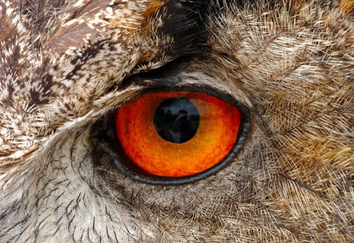
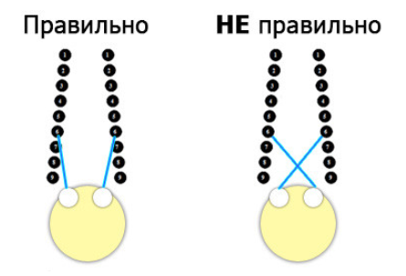
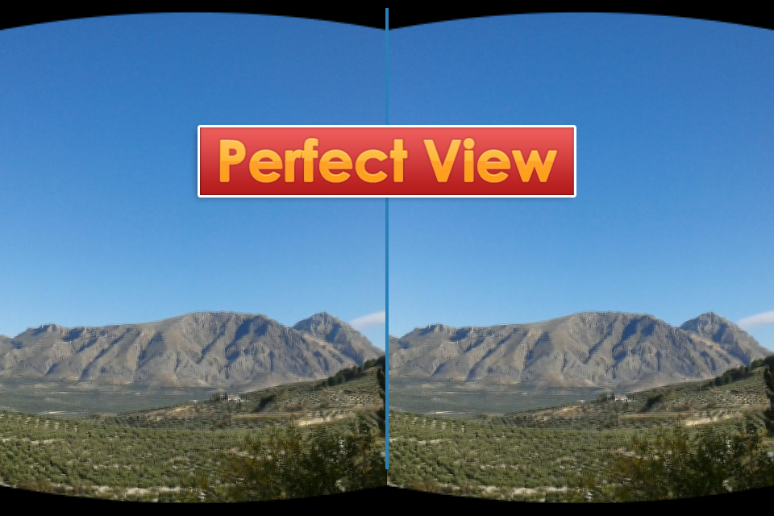
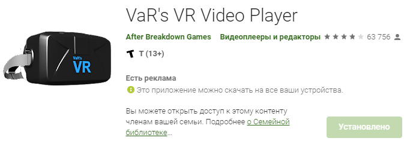

<!--
Title: Как смотреть видосы и улучшать зрение
PostId: 
Published: true
-->

У нас, ботанов, частенько бывают проблемы со зрением от кучи проведенного времени за компом, не так ли? Но что если я скажу, что есть эффективный способ улучшить его, при котором ты можешь заниматься интересными делами?

<!--more-->

## Основная идея

На идею меня подтолкнул [этот пост на хабре](https://habr.com/ru/post/142096/).

Смысл в том, что наше зрение портится от того, что некоторые мышцы глаз становятся слабыми (*мы ведь обычно пялимся куда то перед собой*), но их можно натренировать. И если по особенному "скосить глаза", то будет тот же эффект, как если ты будешь смотреть далеко-далеко вдаль. И если подобрать специальные картинки, то можно варьировать расстояние на сколько далеко ты смотришь тем самым тренируя зрение.

Например посмотри на эти два кружка:

Если ты постараешься расслабить глаза и сфокусироваться ЗА экраном, то эти два кружка сместятся, станут расплывчатыми, а посередине будет третий четкий кружок. Это такой визуальный эффект. Так мы "эмулируем" смотрение вдаль. Чем больше будет расстояние между кружками, тем сильнее дальше тебе нужно смотреть, тем сильнее идет тренировка мышц.

Вот небольшая подсказка, если не получается:

Вот еще пример, как убедиться, что ты все делаешь правильно. Посмотри на эту "стереокартинку", постарайся сфокусировать зрение "за экраном":

Видишь выпуклого волка? Если да, то у тебя все прекрасно получается. Нет? Пиши в комментах, постараюсь объяснить подробнее. Если волк получился "вдавленный", значит ты смотришь не правильно, а скашиваешь глаза перед экраном, а не за ним.

## Как смотреть видосы и улучать зрение

Просто смотреть на кружочки и стереокартинки довольно занудно, так что теперь мое ноу-хау как сделать тренировку более интересной!

На телефоны и планшеты есть специальные программы для просмотра видео и картинок в шлемах виртуальной реальности. Что они делают? Просто разделяют видоряд на две картинки,одна слева, другая справа (как с кружочками в примере выше). Примерно вот так:

Тратататам...!!! Зашевелились извилины?

А теперь попробуй посмотреть видос при помощи метода, описанного в предыдущей главе. Тогда две картинки сместятся в одну четкую, посередине, а ты будешь "виртуально" смотреть далеко-далеко. Твои глазные мышцы будут тренироваться на смотрение вдаль!

Таким образом можно достичь очень неплохих результатов. Например - вот моя история...

## Моя история

В какой то момент в школе я осознал, что у меня далеко не идеальное зрение. При тестах результаты были где-то 0.6 и 0.8 для разных глаз. Сильно не разбираюсь, что это значит, но я явно видел на пару строчек выше той, которая соответствует 100% зрению.

Все было не так плохо, очки я мог не носить... Потом у меня работа, связанная с постоянным сидением за компом, как и все я люблю поторчать в телефоне, много читаю. Явно не полезно для глаз?

Но потом в какой-то момент я начал смотреть с планшета аниме по принципу стереовидосов. Без какой-то цели, потому что на самом деле в этом есть даже какой-то прикол. Ощущения, как в кинотеатре)) И картинка более четкая (потому что разрешение картинок таким образом "складывается")

В общем даже не знаю зачем я это делал, просто для прикола. Но потом через пару месяцев мне пришлось проходить медкомиссию для продления водительских прав и... При тесте у окулиста я показал результаты 1 для левого глаза и 0.8 для правого! Получается зрение улучшилось, причем заметно, хотя с годами должно было только падать! Да и вообще теперь вдаль смотреть как то комфортнее! Врач сказал, что так не бывает...

Самое главное, что такая тренировка мне ничего не стоила, я просто проводил достаточно интересно 20-30 минут в день, смотря анимешки)) Так что очень советую тебе попробовать этот метод, положительные изменения ты увидишь сразу после упражнения. Только пожалуйста, если у тебя есть какие-то противопоказания или ты испытываешь сильный дискомфорт - пожалуйста, НЕ УГАНДОШЬ СЕБЯ! Я же все таки не врач, а просто делюсь интересным наблюдением!

## Программа с которой удобно использовать этот метод

Я перерыл много программ на Андроиде, но лучше всего мне подошла [Var's VR Player](https://play.google.com/store/apps/details?id=com.abg.VRVideoPlayer&hl=ru&gl=US). У нее убогий интерфейс, есть куча минусов, но она зато открывает почти все форматы видео и плюс ко всему там можно точно настроить расстояние между "экранчиками" и их размер.

Так что для начала можешь записать себе на телефон или планшет какой-нибудь интересный фильм, а потом открой его в этой программе. "Скоси глаза" как я описывал выше и понаслаждайся видосом минут 20. Сначала будет немного непривычно, а потом норм))

После упражнения - взгляни в окно куда-нибудь подальше и отметь положительные изменения)))

У тебя все получилось? Буду рад твоим отзывам. Только пожалуйста, не пиши, что это не работает, если не собираешься пробовать))